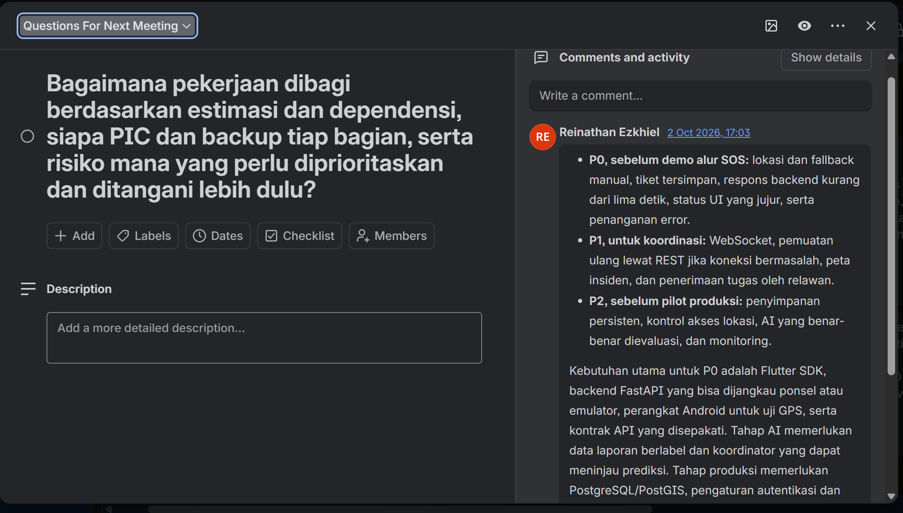
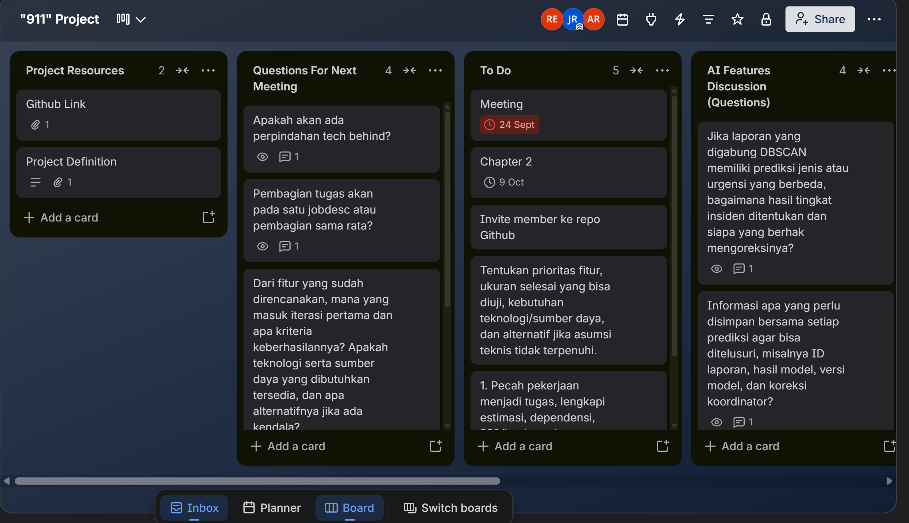
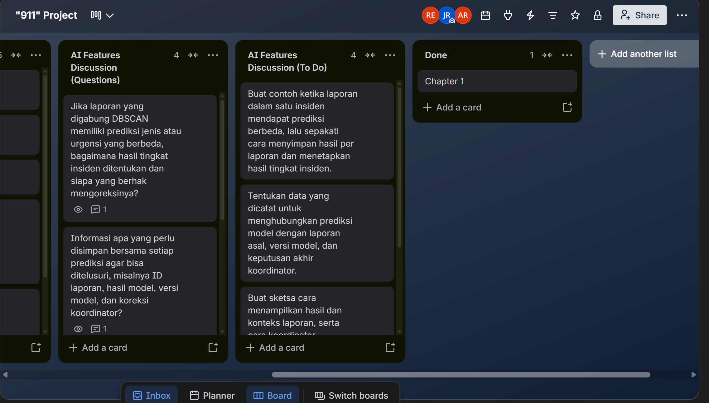
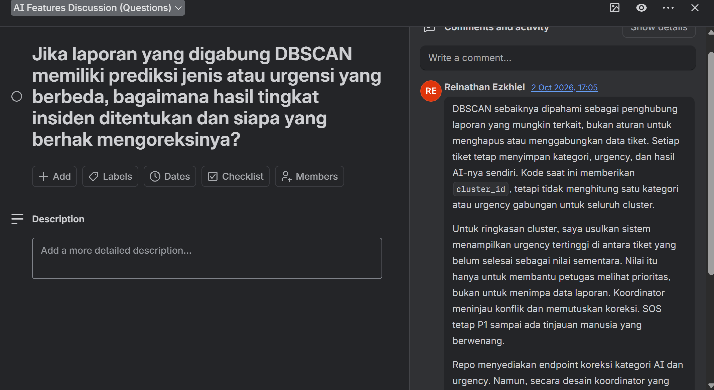
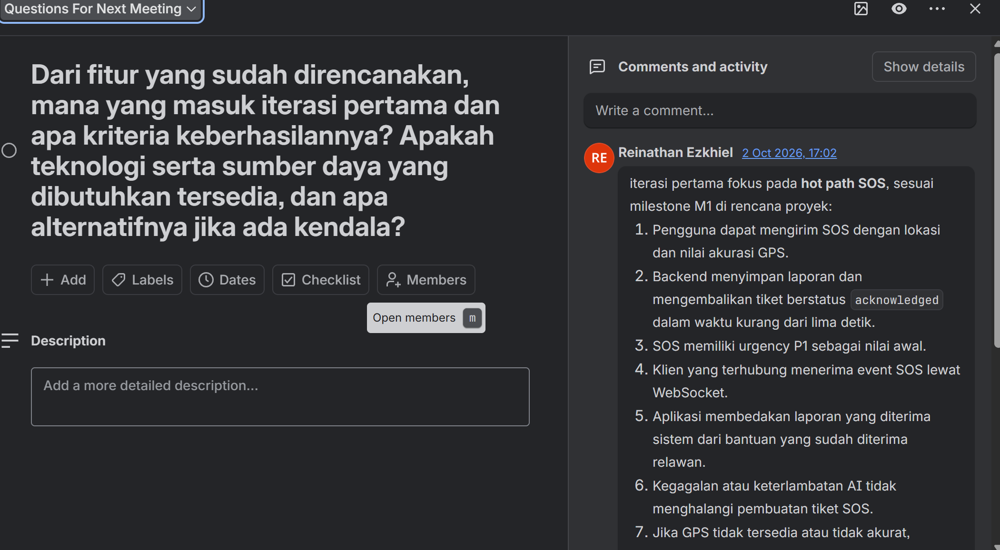

# Analisis Catatan Trello Commencys

## Sumber dan batas bukti

Analisis ini menggabungkan lima tangkapan layar Trello dan [Jawaban_Trello_Reference.txt](../DOCUMENTATION_AND_AI_BUILDING_BLOCKS/Jawaban_Trello_Reference.txt). Berkas teks menyebut dirinya sebagai draf jawaban yang dapat dipakai di Trello atau dibahas dalam rapat. Karena itu, isinya adalah **usulan dan bahan keputusan**, bukan bukti bahwa semua kebijakan telah disahkan atau pekerjaan sudah selesai. Status kartu dan tanggal yang terlihat merupakan keadaan papan pada saat tangkapan layar dibuat; status itu tidak membuktikan keberhasilan sistem.

Papan memperlihatkan daftar sumber proyek, pertanyaan untuk rapat berikutnya, pekerjaan yang perlu diprioritaskan, pertanyaan AI, dan satu kartu Chapter 1 pada daftar Done. Kartu Chapter 2 menampilkan tanggal 9 Oktober. Tanggal pada kartu dapat menjadi sasaran papan, tetapi tidak menetapkan kapasitas atau persetujuan penyerahan dengan sendirinya.

## Pokok pembahasan

**Pembaruan setelah penelaahan:** teks Trello membahas AI secara umum dan berangkat dari rencana awal IndoBERT. Usulan kelompok yang lebih baru memilih Laya Multilingual sebagai kandidat pengganti. Ringkasan Bab 2 mengikuti usulan terbaru, sambil tetap mencatat bahwa model belum diuji atau diterapkan.

### Teknologi dan batas iterasi

Pertanyaan rapat menanyakan apakah tim akan berpindah teknologi. Draf jawaban menyarankan mempertahankan Flutter dan FastAPI pada iterasi pertama agar tenaga diarahkan ke alur SOS, kontrak API, dan verifikasi. Ini adalah **rekomendasi untuk diputuskan**, bukan keputusan final yang terbukti dari gambar papan. Pilihan antarmuka dan komponen sasaran perlu dicatat terpisah dari lingkup iterasi pertama.

Keputusan proyek yang lebih baru menetapkan widget Android ringkas untuk konsumen dan dashboard terpisah untuk operator. Catatan Trello di atas tetap menjadi bukti pembahasan saat papan dibuat; catatan itu tidak membatalkan pembagian antarmuka yang kemudian ditetapkan dalam Bab 1.

### Pembagian kerja

Papan meminta pembagian tugas berdasarkan estimasi dan dependensi serta penetapan PIC dan pengganti. Draf mengusulkan seorang pemilik utama dan seorang pengganti atau peninjau untuk setiap hasil kerja, dengan beban yang diseimbangkan menurut estimasi. Beberapa fokus anggota dicatat dalam draf, tetapi kepemilikan backend, data, AI, dan verifikasi masih memerlukan konfirmasi. Chapter 2 sebaiknya menyebut peran dan tanggung jawab, bukan menyatakan penugasan sebagai keputusan tim sebelum disahkan.

### Iterasi pertama dan kriteria penerimaan

Draf mengutamakan **alur SOS inti**. Kriteria yang diajukan adalah:

1. Pelapor mengirim SOS dengan lokasi dan nilai akurasi koordinat.
2. Layanan menyimpan tiket dan memberi tanda terima dalam target kurang dari lima detik.
3. SOS dimulai pada urgensi P1.
4. Klien yang tersambung menerima pembaruan melalui WebSocket.
5. Antarmuka membedakan tiket yang diterima sistem dari tugas yang telah diterima relawan.
6. Kegagalan analisis AI yang diusulkan atau DBSCAN tidak menghalangi penyimpanan dan pemberitahuan awal. Draf Trello menyebut IndoBERT; usulan model yang lebih baru adalah Laya Multilingual.
7. Pelapor dapat memilih titik secara manual bila GPS tidak tersedia atau tidak cukup akurat.

Angka lima detik adalah target penerimaan yang diusulkan. Lingkungan, titik ukur, perangkat, kondisi jaringan, jumlah percobaan, dan kriteria statistiknya belum ditetapkan dalam draf. Angka tersebut tidak boleh ditulis sebagai hasil atau jaminan layanan.

### Prioritas dan fallback

Draf membagi pekerjaan menjadi alur sebelum demo, koordinasi lanjutan, lalu kesiapan sebelum uji terbatas. Urutan tersebut dapat dipakai sebagai **prioritas awal**:

- Selesaikan pelaporan, pemilihan lokasi cadangan, tanda terima, pesan kesalahan, dan makna status sebelum menambah kemampuan pilihan.
- Lanjutkan ke pemberitahuan, pemuatan ulang status setelah koneksi pulih, peta insiden, dan penerimaan tugas.
- Sebelum uji terbatas, selesaikan penyimpanan persisten, kontrol akses lokasi, evaluasi AI, serta pemantauan dan pemulihan.

Fallback yang ditulis dalam draf konsisten dengan tujuan tersebut: titik manual jika GPS gagal; muat ulang status melalui REST setelah WebSocket pulih; lanjutkan penanganan manusia ketika AI gagal; jangan menyebut heuristik sebagai model tervalidasi; jangan mengandalkan penyimpanan sementara untuk uji yang menuntut riwayat; tampilkan ETA sebagai perkiraan atau sembunyikan bila layanan rute belum tersedia.

### Estimasi dan dependensi

Draf mencantumkan rentang awal untuk beberapa pekerjaan, tetapi tidak menyediakan dasar kapasitas, dependensi, perangkat, atau tingkat keyakinan yang cukup untuk menjadikannya jadwal. Bab 2 karena itu tidak mengulang angka tersebut. Tim baru menetapkan estimasi setelah lingkup, pemilik pekerjaan, kapasitas, dan kriteria keluar disepakati.

Ketergantungan yang terlihat ialah kebutuhan dan kontrak API sebelum implementasi klien; data berlabel serta pemilik evaluasi sebelum model; identitas dan aturan akses sebelum koordinasi relawan; serta sumber peta dan lingkungan operasional sebelum ETA dipakai untuk pengujian. Pekerjaan paralel tetap memerlukan integrasi dan kriteria keluar yang jelas.

### Risiko dan urutan perhatian

Draf memakai skala kemungkinan dan dampak satu sampai lima serta mengusulkan nilai awal untuk GPS, kehilangan data atau koneksi, privasi, kesalahan model, penggabungan laporan yang keliru, WebSocket terputus, dan SOS berulang setelah batas waktu. Nilai tersebut adalah **penilaian awal tim**, bukan frekuensi terukur. Perkalian dua skala ordinal tidak boleh disajikan sebagai ukuran risiko objektif tanpa definisi dan persetujuan skala. Chapter 2 sebaiknya menjaga urutan perhatian yang masuk akal, lalu menandai skor sebagai belum disahkan.

Risiko dengan konsekuensi tertinggi dalam catatan berkaitan dengan lokasi yang salah, tiket yang hilang, kebocoran lokasi, dan klasifikasi yang menurunkan perhatian pada laporan gawat. Risiko berikutnya meliputi penggabungan kejadian yang tidak tepat, keterlambatan status saat jaringan berubah, serta pengiriman SOS berulang. Setiap mitigasi memerlukan bukti uji dan pemilik; keberadaan usulan saja tidak menutup risiko.

### Keputusan AI dan pengelolaan data

Diskusi meminta cara menangani beberapa laporan dalam satu kelompok dengan prediksi berbeda. Jawaban tim menyatakan DBSCAN sebaiknya membentuk kandidat keterkaitan, bukan menghapus atau melebur data laporan. Setiap tiket tetap memiliki kategori dan urgensinya sendiri. Nilai urgensi tertinggi dari tiket yang belum selesai dapat ditampilkan sebagai ringkasan sementara, tetapi perlu persetujuan aturan dan tidak boleh mengganti nilai per tiket. SOS prioritas tinggi tidak diturunkan otomatis; koordinator berwenang meninjau konflik.

Bahan juga mengusulkan jejak untuk ID laporan, keluaran dan versi model, tingkat keyakinan, versi parameter, koreksi, alasan, peninjau, serta waktu. Koreksi koordinator bukan label pelatihan otomatis. Label perlu ditinjau; data dianonimkan seperlunya; pembagian data latih dan uji mencegah insiden atau kelompok laporan yang sama muncul di kedua sisi; evaluasi melaporkan hasil per kelas dan menaruh perhatian pada laporan kritis yang terlewat. Persetujuan rilis memerlukan hasil yang dapat diperiksa dan cara kembali ke versi sebelumnya.

## Peta integrasi ke Bab 2

| Isi Trello | Penempatan dalam Bab 2 | Batas penulisan |
|---|---|---|
| Prioritas alur SOS dan kriteria penerimaan | Ruang lingkup, iterasi pertama, dan mutu | Tulis sebagai target yang diusulkan, bukan hasil uji. |
| Pembagian PIC dan backup | Organisasi dan tata kelola | Peran ditentukan dalam naskah; nama menunggu persetujuan tim. |
| Estimasi dan dependensi | Estimasi dan jadwal | Bab 2 tidak mengulang rentang awal yang belum memiliki dasar kapasitas; tim menetapkan estimasi setelah lingkup disepakati. |
| Fallback GPS, jaringan, AI, penyimpanan, dan ETA | Risiko dan kesiapan | Jelaskan syarat kapan fallback digunakan dan bukti pengujiannya. |
| Perbedaan pemberitahuan dan penerimaan tugas | Alur status dan koordinasi relawan | Gunakan istilah konsisten; pengiriman bukan penerimaan. |
| Perbedaan prediksi dalam satu kelompok | Tata kelola triase dan koreksi | Simpan hasil setiap laporan dan jadikan ringkasan sebagai petunjuk sementara. |
| Jejak versi dan koreksi model | Mutu, data, dan tanggung jawab AI | Koreksi tidak menjadi data latih tanpa peninjauan. |

## Pertanyaan yang tetap terbuka

- Catatan Trello mengusulkan mempertahankan Flutter dan FastAPI pada iterasi awal. Bab 1 kini menetapkan widget Android untuk konsumen, dashboard terpisah untuk operator, dan Flutter sebagai wadah alur laporan. Detail implementasi kedua antarmuka dan layanan masih perlu disepakati.
- Siapa pemilik dan pengganti untuk API, data, AI, keamanan, dan verifikasi?
- Bagaimana target lima detik diukur dan pada perangkat serta jaringan apa?
- Apa definisi operasional laporan diterima, notifikasi terkirim, tugas diterima, tiba, dan selesai?
- Siapa yang berhak mengoreksi urgensi, dan apakah perubahan tertentu memerlukan peninjau kedua?
- Kapan ringkasan urgensi kelompok boleh ditampilkan, dan bagaimana ia dihitung?
- Apa definisi, sumber, versi, dan pemilik dataset evaluasi?
- Apakah rentang estimasi, risiko, serta tanggal pada papan disahkan oleh seluruh anggota?
- Apa kebijakan akses dan retensi koordinat presisi?

## Tangkapan layar yang ditinjau

### Trello 1: pertanyaan tentang pembagian kerja dan prioritas risiko

Tangkapan ini menampilkan pertanyaan rapat tentang estimasi, dependensi, PIC, pengganti, dan risiko yang perlu ditangani lebih dulu. Komentar berisi urutan prioritas, kebutuhan teknis, dan fallback yang diusulkan.

### Trello 2: papan proyek

Tampilan papan menunjukkan daftar sumber, pertanyaan rapat, pekerjaan lanjutan, dan pertanyaan AI. Kartu Chapter 2 terlihat dengan tanggal sasaran 9 Oktober. Status papan dicatat sebagai konteks perencanaan, bukan bukti bahwa isi kartu telah dilaksanakan.

### Trello 3: pertanyaan dan pekerjaan AI

Tangkapan ini memperlihatkan pemisahan pertanyaan AI dari pekerjaan yang perlu ditindaklanjuti, termasuk pertanyaan tentang konflik klasifikasi dan pencatatan data prediksi. Kartu Chapter 1 berada pada daftar Done dalam cuplikan papan.

### Trello 4: perbedaan hasil pada kelompok laporan

Diskusi menekankan bahwa DBSCAN membantu menemukan laporan terkait, bukan melebur atau menghapus laporan. Ringkasan urgensi tertinggi hanya bersifat sementara, sedangkan koreksi tetap berada pada koordinator.

### Trello 5: lingkup iterasi pertama

Kartu ini memusatkan iterasi awal pada alur SOS, tanda terima, status, notifikasi, ketahanan terhadap kegagalan AI, dan pilihan lokasi manual. Semua butir perlu ditetapkan sebagai kriteria uji sebelum dianggap selesai.

## Sumber yang dianalisis

- [Jawaban_Trello_Reference.txt](../DOCUMENTATION_AND_AI_BUILDING_BLOCKS/Jawaban_Trello_Reference.txt), draf tanggapan untuk rapat dan papan.
- [Trello_1.png](../DOCUMENTATION_AND_AI_BUILDING_BLOCKS/Trello_1.png)
- [Trello_2.png](../DOCUMENTATION_AND_AI_BUILDING_BLOCKS/Trello_2.png)
- [Trello_3.png](../DOCUMENTATION_AND_AI_BUILDING_BLOCKS/Trello_3.png)
- [Trello_4.png](../DOCUMENTATION_AND_AI_BUILDING_BLOCKS/Trello_4.png)
- [Trello_5.png](../DOCUMENTATION_AND_AI_BUILDING_BLOCKS/Trello_5.png)
