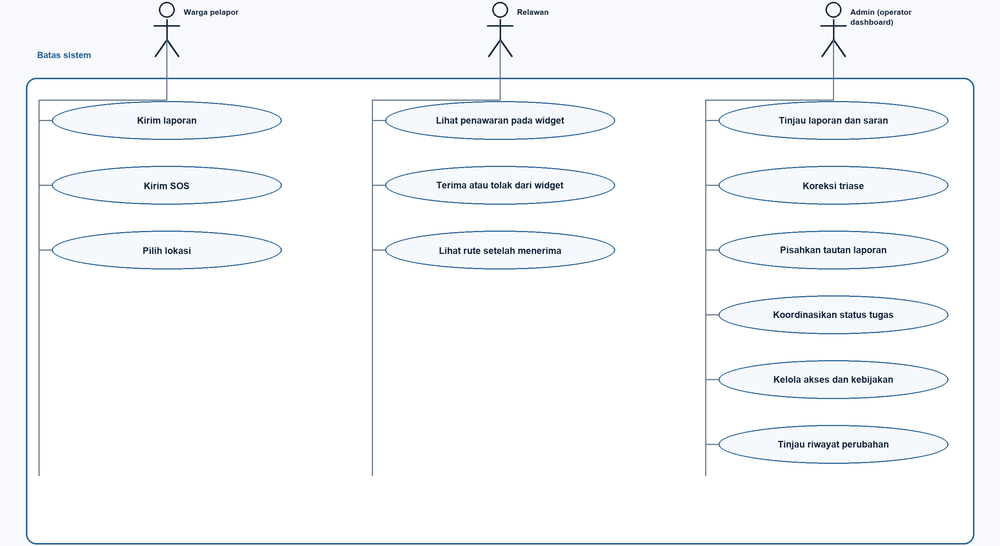
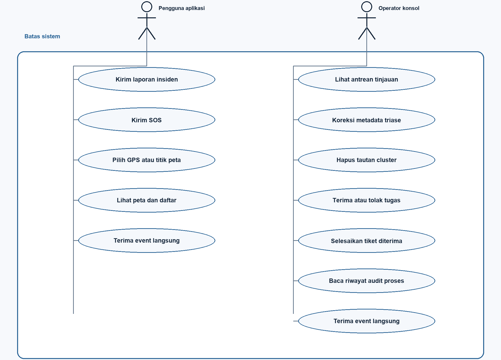

# FORUML_1 — Commencys Use Case Analysis and Diagrams

**Course:** Chapter3.pdf p.8 (actors, goals, relationships); p.3 (UML views).  
**Book:** Braude Ch. 11 §§11.5/11.9 and Ch. 15 §15.2.1; see [BOOK_2](../BOOK/BOOK_2_UML_MODELING.md).  
**Rule:** target and as-is are separate models.

**Time boundary:** the as-is diagram, catalogue, and code locators describe the pre-scaffold working-tree snapshot reviewed on 7 October 2026. They are retained as historical analysis, not as a description of the current source. The current scaffold status is in [ABOUT_1](../ABOUT/ABOUT_1_CODEBASE_CURRENT_STATE.md). The target diagram remains the requirements view.

## 1. Actors

| Target actor | Chapter 1 goal | Current scaffold state |
|---|---|---|
| Citizen/reporter | Submit incident/SOS with useful location. | Reporter widget is structural; no report or location action runs. |
| Volunteer | View task offers and explicitly accept or reject through the volunteer widget. | Widget controls and task-feed route are scaffold only; no identity or action is verified. |
| Admin | Review/correct reports, coordinate offers, manage access, and inspect audit history through the operator dashboard. | Dashboard and access boundaries are placeholders without role enforcement. |

An actor association expresses a goal, not proof of implemented authorization.

## 2. Target use-case diagram

The PNG is an independently drawn overview of the PlantUML source below, not a direct renderer export.

    @startuml
    left to right direction
    actor "Citizen / reporter" as Citizen
    actor "Volunteer" as Volunteer
    actor "Admin (operator dashboard)" as Admin

    rectangle "Commencys — Chapter 1 target" {
      usecase "Submit incident report" as UC1
      usecase "Send urgent SOS" as UC2
      usecase "Provide incident location" as UC3
      usecase "View relevant incidents" as UC4
      usecase "View and accept or decline from widget" as UC5
      usecase "Review uncertain report" as UC7
      usecase "Correct triage metadata" as UC8
      usecase "Manage duplicate link" as UC9
      usecase "Track response / resolution" as UC10
      usecase "Approve assignment offer" as UC13
      usecase "Manage users, roles and policy" as UC11
      usecase "Inspect accountable audit history" as UC12
    }

    Citizen -- UC1
    Citizen -- UC2
    UC1 ..> UC3 : <<include>>
    UC2 ..> UC3 : <<include>>
    Citizen -- UC4
    Volunteer -- UC4
    Volunteer -- UC5
    Volunteer -- UC10
    Admin -- UC4
    Admin -- UC7
    Admin -- UC8
    Admin -- UC9
    Admin -- UC10
    Admin -- UC13
    Admin -- UC11
    Admin -- UC12
    @enduml

Target-only semantics: targeted task offer, authenticated accept/decline from the volunteer widget, response tracking, and accountable audit. The admin uses the operator dashboard; “operator” is not a separate account role. Duplicate management means reversible review, not deletion of reports. The diagram is a target model, not current behavior.

## 3. As-is use-case diagram

The PNG is an independently drawn overview of the PlantUML source below, not a direct renderer export.

    @startuml
    left to right direction
    actor "Unauthenticated client user" as User
    actor "Unauthenticated console operator" as Operator

    rectangle "Commencys — current working-tree prototype" {
      usecase "Submit incident report" as A1
      usecase "Send SOS" as A2
      usecase "Choose GPS or map point" as A3
      usecase "View incident map/feed" as A4
      usecase "Review flagged tickets" as A5
      usecase "Correct triage metadata" as A6
      usecase "Clear one cluster link" as A7
      usecase "Accept or reject assignment" as A8
      usecase "Resolve accepted ticket" as A11
      usecase "Read process-local audit history" as A9
      usecase "Receive process-local live event" as A10
    }

    User -- A1
    User -- A2
    A1 ..> A3 : <<include>>
    A2 ..> A3 : <<include>>
    User -- A4
    User -- A10
    Operator -- A4
    Operator -- A5
    Operator -- A6
    Operator -- A7
    Operator -- A8
    Operator -- A11
    Operator -- A9
    Operator -- A10
    @enduml

“Unauthenticated” is a security qualifier, not a named product role. Operator means a person using the UI, not an enforced coordinator identity. The current accept and reject actions record the supplied name without verifying identity or authority. Resolution is available only after acceptance.

## 4. Use-case catalogue

| ID | Goal | Current state | Evidence |
|---|---|---|---|
| UC-01 | Submit located incident | Source-present; device verification open | report_screen.dart:73,85; POST /api/incidents |
| UC-02 | Send located SOS | Source-present; device verification open | sos_screen.dart:62,77; POST /api/sos |
| UC-03 | View map/feed | Prototype | map_screen.dart; alerts_screen.dart |
| UC-04 | Receive live event | Partial; all connected sockets, no targeting | main.py:81,561; websocket_service.dart |
| UC-05 | Review uncertain ticket | Prototype, unauthenticated | main.py:435; browser console |
| UC-06 | Correct triage metadata | Prototype; raw report fields preserved | main.py:441 |
| UC-07 | Clear false cluster link | Prototype | main.py:483 |
| UC-08 | Accept or reject assignment | Prototype actions present; identity and role are unverified | main.py:342,378; web/app.js |
| UC-09 | Receive nearby targeted alert | Target only | Chapter 1 p.6; no radius/role filter |
| UC-10 | Enforce responder identity and authority | Target only; current action routes have no authentication | Chapter 1 pp.8–9; no identity or role checks |
| UC-11 | Resolve accepted ticket | Route present; actor is not authenticated or authorized | main.py:405; web/app.js |
| UC-12 | Manage users/roles | Target only | No auth/admin implementation |
| UC-13 | Durable accountable audit | Target/partial audit shape | main.py:49-78,506; memory/unverified actors |

## 5. Consistency rules

- The current accept action changes ticket status, but does not verify the supplied responder identity or enforce a responder role.
- Use cases express actor goals; endpoints belong in API/component models.
- Distinguish reporter severity, triage urgency, category, AI category, status and role.
- Later acceptance baseline should add preconditions, normal/alternate flow, postconditions, data access and test evidence.

## 6. Sources

Chapter 3 p.8; Chapter 1 pp.6, 8–9; Braude Ch. 11/15. Links point to working-tree code, not a deployed service.

**Time boundary:** the as-is diagram and source locators describe the pre-scaffold repository snapshot reviewed on 7 October 2026. The current implementation status is recorded in [ABOUT_1](../ABOUT/ABOUT_1_CODEBASE_CURRENT_STATE.md). The target use cases remain requirements, not active behavior.
