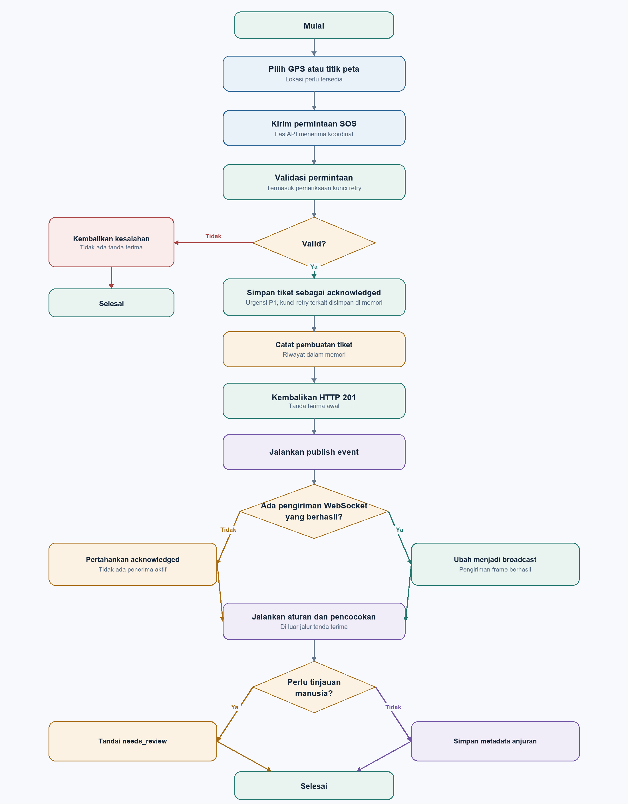
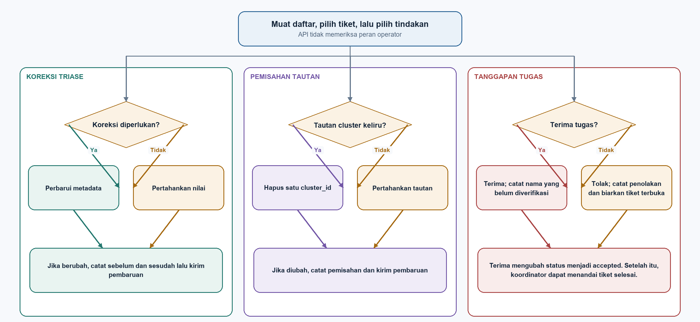

# FORUML_2 — Interaction Overview Diagrams for SOS and Coordination

**Course:** Chapter3.pdf pp.9–11; IOD definition p.10.  
**Book:** Braude Ch. 16 interaction/activity concepts and Ch. 11 requirements; [BOOK_2](../BOOK/BOOK_2_UML_MODELING.md).  
**View:** historical pre-scaffold flow snapshot; target paths are labeled.

**Time boundary:** these flow diagrams and code locators describe the working tree reviewed on 7 October 2026, before the code was reduced to the current commented scaffold. They are retained to preserve the earlier analysis and are not executable-flow evidence. See [ABOUT_1](../ABOUT/ABOUT_1_CODEBASE_CURRENT_STATE.md) for the current source state.

## 1. Notation and evidence

These IODs use PlantUML activity notation. Each activity labeled «interactionUse» names a referenced interaction defined below. The PNGs are separately drawn illustrations of the flows, not exports of the PlantUML source. The PlantUML has not been parsed by a UML renderer.

The SOS handler stores and returns the ticket before background work. A keyed repeat with the same request replays that ticket and skips duplicate background work; a different request under the same key is rejected. The key table and ticket are process-local. It registers publish before enrichment. Publish with no successful sends leaves status acknowledged; at least one successful send changes it to broadcast. References: [SOS](../../../backend/app/main.py#L322), [publish](../../../backend/app/main.py#L102), [enrichment](../../../backend/app/main.py#L130).

## 2. IOD-1 — SOS intake, delivery, triage

The accompanying image shows the first-creation path. A matching retry returns the existing ticket before publish or enrichment; the alternate response and conflict behavior are recorded in I2 below.

    @startuml
    title IOD-1 — Historical SOS intake and asynchronous follow-up
    start
    :«interactionUse» I1 Select location;
    :«interactionUse» I2 Submit SOS request;
    :Validate request and coordinates;
    if (Valid?) then (yes)
      :Check idempotency key;
      if (Same key and same request already stored?) then (yes)
        :Return HTTP 200 with the existing ticket;
        stop
      else (no)
        if (Key already belongs to different request data?) then (yes)
          :Return HTTP 409 without creating a ticket;
          stop
        else (no)
          :Store new ticket as acknowledged;
          :Append create audit record;
          :Return HTTP 201 receipt;
          :«interactionUse» I3 Publish initial event;
          if (At least one socket send succeeds?) then (yes)
            :Set status to broadcast;
            :Send broadcast status frame;
          else (no)
            :Keep status acknowledged;
          endif
          :«interactionUse» I4 Enrich triage and matching;
          if (Review required?) then (yes)
            :Keep ticket available in review queue;
          else (no)
            :Keep advisory metadata;
          endif
          :Emit update event when changed;
          stop
        endif
      endif
    else (no)
      :Return validation error;
      stop
    endif
    @enduml

### Referenced interactions

| Ref | Participants/precondition | Normal result | Alternate |
|---|---|---|---|
| I1 Select location | Reporter, Flutter location service/map; report/SOS form open. | GPS or explicitly tapped point selected. | Permission/service failure; device behavior unverified. |
| I2 Submit SOS | Client/FastAPI; coordinates available and server reachable. | First request stores a critical/P1 ticket and returns 201; retry with the same key and payload replays that ticket with 200. | Invalid input returns validation error; a network timeout keeps the exact request and key for retry without claiming receipt. A changed payload under the same key returns 409. |
| I3 Publish | Background task and process-local socket set; ticket already stored. | Initial event; if any send succeeds, status changes to broadcast and another frame is sent. | No successful send leaves acknowledged. Not nearby delivery/read receipt. |
| I4 Enrich | Rules/matcher/store; ticket exists after first creation. | Advisory metadata/review flag updated; changed data may be broadcast. | Replays do not schedule another enrichment; work remains in-process and is not durable. |

HTTP 201 and broadcast must not be worded as “help is on the way.”

## 3. IOD-2 — Review, assignment response, and resolution

    @startuml
    title IOD-2 — Historical review and coordination actions
    start
    :«interactionUse» I5 Load incidents or review queue;
    if (Ticket flagged for review?) then (yes)
      :«interactionUse» I6 Inspect ticket;
      if (Metadata correction needed?) then (yes)
        :«interactionUse» I7 Correct triage metadata;
        :Preserve original report fields;
        :Append before/after audit detail;
        :Broadcast correction update;
      else (no)
      endif
    else (no)
    endif
    if (Cluster link is false?) then (yes)
      :«interactionUse» I8 Clear this ticket's cluster link;
      :Append split audit detail;
      :Broadcast ticket update;
    else (no)
    endif
    if (Responder accepts the task?) then (yes)
      :«interactionUse» I9 Accept assignment;
      :Set status to accepted and store supplied name;
      :Append acceptance audit record;
      :Broadcast acceptance update;
      note right
        Acceptance is explicit, but identity and role are unverified.
      end note
    else (no)
      :Record rejection without closing the ticket;
      :Broadcast rejection event;
    endif
    if (Accepted task is complete?) then (yes)
      :«interactionUse» I10 Resolve accepted ticket;
      :Set status to resolved and record completion time;
      :Append resolution audit record;
      :Broadcast resolution update;
    else (no)
    endif
    stop
    @enduml

| Ref | Current behavior | Constraint |
|---|---|---|
| I5 Load queue | REST returns incidents or needs_review subset. | No role/access check. |
| I6 Inspect | UI loads ticket detail/audit. | Exact coordinates exposed by current API. |
| I7 Correct | Changes triage metadata; retains raw report fields. | Audit is stored in local SQLite; actor unverified and log is not tamper-proof. |
| I8 Split | Clears this ticket’s cluster link. | Does not delete/rewrite source report. |
| I9 Accept/reject | Explicit responder action; acceptance sets `accepted` and stores the supplied name. Rejection is audited while the ticket remains open. | Name and actor are unverified; there is no role check. |
| I10 Resolve | An accepted ticket can be marked resolved with a completion timestamp. | Coordinator identity and authority are not verified. |

Target extension for future design: authenticated admin and volunteer identities, admin-created offers, recipient selection under an approved policy, and role checks before targeted delivery or a volunteer decision. The current scaffold keeps these route boundaries but returns HTTP 501; it does not execute accept, reject, or resolve actions.

## 4. Current Chapter 1 target alignment

The target actor mapping is reporter, volunteer, and admin. The reporter uses the report/SOS widget and Flutter flow. The volunteer uses a separate compact widget to view an offered task and explicitly accept or reject it. The admin uses the operator dashboard to review reports, triage suggestions, and task status. “Operator” describes the admin's dashboard function, not an additional role.

An accepted task may unlock an ETA request; an ETA is an estimate. A rejected offer leaves the report open for the admin to consider another eligible volunteer. The scaffold preserves the task-feed and decision boundaries, but neither role checks nor actions are active. Historical event behavior in the earlier sections must not be presented as the current implementation.

## 5. Cross-view checks

- State wording follows backend behavior, not the misleading enum comment.
- SQLite persists ticket and audit state; the API still uses a process-local working set and WebSocket set.
- Delivery branch tests successful sends, not nearby targeting.
- Audit-shaped records do not prove human review completion.
- Ensure the final UML tool preserves interaction-use labels; the diagrams have not been renderer-validated.

## 6. Sources

Chapter 3 pp.9–11; Braude Ch. 16; backend main.py, ai_pipeline.py, models.py.

**Implementation status:** both interaction overviews are target scenarios for analysis. The current scaffold does not execute their SOS, notification, review, or assignment flows; see [ABOUT_1](../ABOUT/ABOUT_1_CODEBASE_CURRENT_STATE.md).
