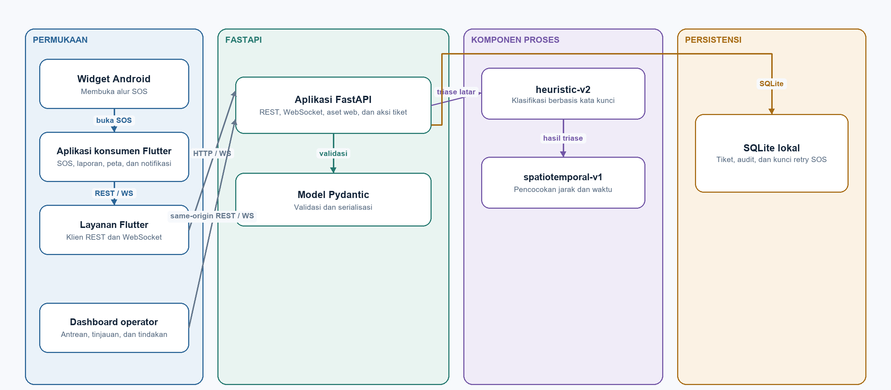
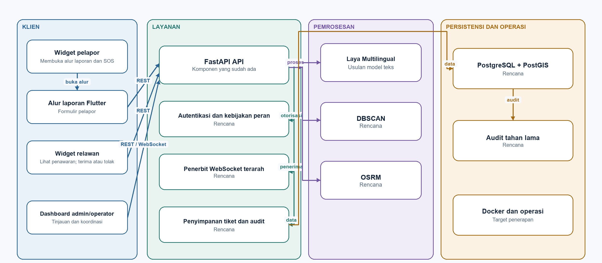

# FORUML_3 — Commencys Component Diagrams: As-Is and Chapter 1 Target

**Time boundary:** the as-is diagram and its source description are a historical snapshot of the pre-scaffold repository reviewed on 7 October 2026. They do not describe the current source. See [ABOUT_1](../ABOUT/ABOUT_1_CODEBASE_CURRENT_STATE.md). The target diagram follows the reporter widget, volunteer task widget, and admin operator dashboard mapping.

**Course:** Chapter3.pdf p.4.  
**Book:** Braude Ch. 18 architecture and Ch. 15 model coherence; [BOOK_2](../BOOK/BOOK_2_UML_MODELING.md).  
**Purpose:** display boundaries/dependencies without blending prototype and proposal.

## 1. Historical as-is component diagram (7 October 2026)

The PNG is a separately drawn overview, not a direct export of the PlantUML source below.

    @startuml
    title Commencys current working-tree components
    skinparam componentStyle uml2

    actor Reporter
    actor "Coordinator / operator" as Operator
    component "Android home-screen widget\nSOS shortcut" as Widget
    component "Flutter consumer app\nSOS, reports, map, alerts" as Mobile
    component "Flutter services\nHTTP API client + WebSocket" as ClientSvc
    component "Operator dashboard\nHTML / CSS / JavaScript" as Web
    component "FastAPI application\nREST + WebSocket + static mount" as API
    component "Pydantic request/ticket models" as Models
    component "SQLite state store\ntickets, audit, SOS retry keys" as Store
    component "In-process working set\nPython dictionaries + asyncio lock" as WorkingSet
    component "Background publish/enrichment" as Tasks
    component "Keyword triage\nheuristic-v2" as Rules
    component "Proximity/time matcher\nspatiotemporal-v1" as Matcher
    component "Process-local WebSocket set" as Sockets
    component "OpenStreetMap tile service" as OSM

    Reporter --> Widget
    Reporter --> Mobile
    Widget --> Mobile : launch /sos
    Operator --> Web
    Mobile --> ClientSvc : REST / WS
    ClientSvc --> API : HTTP / WebSocket
    Web --> API : same-origin REST / WS
    API --> Models : validate / serialize
    API --> WorkingSet : load / read / update
    API --> Store : commit / reload
    API --> Tasks : publish then enrich
    Tasks --> Rules : classify
    Tasks --> Matcher : link candidates
    Tasks --> WorkingSet : update metadata
    Tasks --> Store : persist ticket and audit
    API --> Sockets : register client
    Tasks --> Sockets : broadcast frame
    Mobile --> OSM : map tiles
    @enduml

### Interpretation

In this historical snapshot, the Android widget opened the Flutter SOS route and the same-origin dashboard displayed the operator queue. The snapshot also included local SQLite persistence and workflow actions. Those details describe the earlier tree only; they were removed or hollowed during scaffold preparation.

Evidence: [state/routes](../../../backend/app/main.py#L49), [static mount](../../../backend/app/main.py#L577), [tile layer](../../../lib/screens/map_screen.dart#L206), [AI versions](../../../backend/app/ai_pipeline.py#L38).

## 2. Chapter 1 target component diagram

The PNG is a separately drawn overview, not a direct export of the PlantUML source below.

This is the Chapter 1 target configuration. The reporter uses a compact Android widget that opens the report flow. The volunteer uses a separate compact Android widget to inspect task offers and accept or reject a task. The admin uses the operator dashboard for review and coordination; operator is not a separate role. FastAPI declarations and widget shells are present in the current scaffold; role control, targeted delivery, database, AI execution, routing, and deployment dependencies shown here remain target additions or integrations. Dashed arrows are not active integrations.

    @startuml
    title Commencys — Chapter 1 target architecture (not current implementation)
    skinparam componentStyle uml2

    actor "Citizen / reporter" as Citizen
    actor "Volunteer" as Volunteer
    actor "Admin" as Admin

    package "Proposed client layer" {
      component "Android reporter widget\nreport / SOS" as Widget <<target>>
      component "Flutter report flow" as Flow <<target>>
      component "Android volunteer task widget\nview / accept / reject" as TaskWidget <<target>>
      component "Admin operator dashboard" as Dashboard <<target>>
    }
    package "Proposed service layer" {
      component "FastAPI API (reused from current)" as API
      component "Authentication / role policy\ncoordinate access" as Auth <<target>>
      component "WebSocket delivery\nrecipient scope/receipt" as Notify <<target>>
      component "Laya Multilingual triage" as Laya <<target>>
      component "DBSCAN duplicate analysis" as DBSCAN <<target>>
      component "OSRM road routing" as OSRM <<target>>
    }
    package "Proposed persistence" {
      component "PostgreSQL + PostGIS" as DB <<target>>
      component "Durable audit records" as Audit <<target>>
    }
    node "Proposed Docker deployment" as Deploy <<target>>

    Citizen --> Widget
    Widget --> Flow : opens report/SOS
    Flow ..> API : REST
    Volunteer --> TaskWidget : view offer and decide
    TaskWidget ..> API : task feed / accept / reject
    Admin --> Dashboard
    Dashboard ..> API : REST / WebSocket
    API ..> Auth : authenticate / authorize
    API ..> Notify : relevant alert delivery
    Notify ..> TaskWidget : task offer
    API ..> DB : ticket/spatial data
    API ..> Audit : durable history
    API ..> Laya : advisory classification
    API ..> DBSCAN : duplicate analysis
    API ..> OSRM : road route / ETA
    Deploy ..> API
    Deploy ..> DB
    Deploy ..> Notify
    Deploy ..> Laya
    Deploy ..> DBSCAN
    Deploy ..> OSRM
    @enduml

The Chapter 1 target remains separate from this historical snapshot. Its current user-interface baseline is a reporter widget, a Flutter report-flow host, a volunteer task widget, and a separate dashboard used by the admin.

## 3. Historical prototype-to-target delta

| Boundary | Current | Chapter 1 target | Implied decision/work |
|---|---|---|---|
| User interface | Historical Flutter app, Android widget, and operator dashboard | Reporter widget, volunteer task widget, Flutter report-flow host, and separate admin dashboard | Preserve role separation; current actions remain disabled. |
| Persistence | Local SQLite plus one-process working set | PostgreSQL/PostGIS/audit | Operated migration, backup, and recovery. |
| Identity | No auth/roles | Roles/privacy controls | Role matrix, location policy. |
| Delivery | Process-wide WS sends | Targeted responder delivery | Recipient criteria, ACK, acceptance semantics. |
| Triage | Keyword rules | Laya Multilingual proposal | Indonesian dataset/evaluation/calibration/fallback/rollback. |
| Clustering | Custom matcher | DBSCAN | Duplicate definition, labels, reversibility. |
| ETA | Haversine/fixed-speed stub | OSRM | Provider, freshness, measurement. |
| Operations | Local API and CI config | Docker target | Deployment, monitoring, recovery owner. |

## 4. Component contracts for later design

REST and WebSocket contracts must not imply client read/acceptance. Persistence/audit need transaction and actor provenance. Triage/matching should remain advisory until evaluated and should preserve original reports. Authorization must scope precise coordinates/mutations. External map/routing services need fallback and ownership. A target component becomes current only when code/configuration and runtime evidence support it.

## 5. Sources

Chapter 3 p.4; Chapter 1 p.6 and pp.8–9; Braude Ch. 15/18; source inventory in [ABOUT_1](../ABOUT/ABOUT_1_CODEBASE_CURRENT_STATE.md).

**Time boundary:** the as-is diagram records the pre-scaffold prototype reviewed on 7 October 2026. It is a historical source snapshot, not the current runtime. The current scaffold component map is [architecture.mmd](../../../docs/architecture.mmd). The target diagram remains a proposal.
