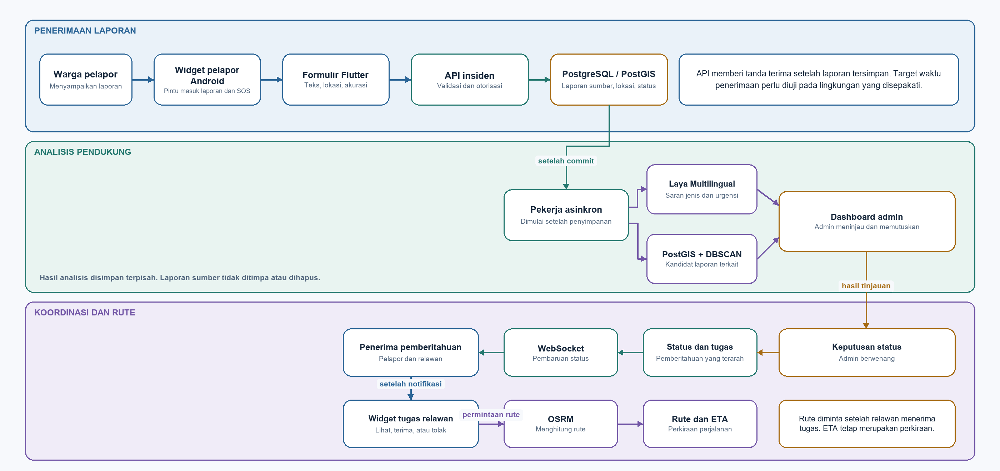

# BAB 1: PENDAHULUAN

## Identitas Proyek

**Judul proyek:** Commencys: Platform Respons Darurat Dini Berbasis Komunitas  
**Universitas:** Universitas Indonesia  
**Fakultas:** Fakultas Teknik  
**Departemen:** Teknik Elektro  
**Program:** Rekayasa Perangkat Lunak  
**Semester:** Ganjil 2026/2027

| Nama | NPM |
|---|---:|
| Reinathan Ezkhiel Kurniawan | 2406397675 |
| Alwahib Raffi Raihan | 2406397630 |
| Joshua Ricardo Riangkamang | 2406361946 |

## 1.1 Latar Belakang

Dalam keadaan darurat, informasi yang tepat waktu dan lokasi yang memadai membantu pihak terkait menilai situasi. Warga dapat mengetahui kejadian lebih awal, tetapi laporan yang tersebar di banyak saluran menyulitkan validasi dan koordinasi. Commencys dirancang sebagai prototipe berbasis komunitas untuk membantu pelaporan dan koordinasi pada masa kritis (*golden period*).

Layanan panggilan darurat 112 menghubungkan laporan dengan instansi terkait melalui tata laksana resmi [2]. Commencys tidak menggantikan layanan tersebut, dan tanda terima laporan bukan bukti bahwa bantuan resmi telah dikirim.

Rancangan awal mengusulkan triase teks dengan IndoBERT. Kelompok kini mengajukan **Laya Multilingual** sebagai kandidat pengganti untuk laporan berbahasa Indonesia. Kecocokannya perlu diuji menggunakan data Commencys sebelum model dipilih. DBSCAN diusulkan untuk mencari laporan yang mungkin berkaitan, WebSocket untuk pembaruan status, dan OSRM untuk perhitungan rute.

## 1.2 Rumusan Masalah

Berangkat dari kebutuhan tersebut, proyek ini membahas beberapa pertanyaan. Bagaimana merancang pengiriman laporan SOS melalui perangkat seluler dengan lokasi yang dapat diperiksa dan tanda terima yang tidak disamakan dengan pengiriman bantuan? Bagaimana mengelompokkan jenis dan tingkat urgensi laporan berbahasa Indonesia dengan cara yang dapat dievaluasi dan ditinjau manusia? Bagaimana mengenali laporan yang mungkin berkaitan berdasarkan waktu dan lokasi tanpa menghapus laporan asal? Bagaimana menyampaikan pembaruan kepada pihak yang berwenang secara terukur dan menyajikan perkiraan perjalanan yang tidak menyesatkan? Bagaimana melindungi data pelapor, khususnya lokasi, dan menjaga riwayat perubahan agar dapat ditinjau?

Pertanyaan tersebut memandu penetapan kebutuhan dan batas rancangan.

## 1.3 Tujuan

### 1.3.1 Tujuan Umum

Proyek ini bertujuan merancang dan mengembangkan prototipe Commencys untuk menerima laporan kejadian berbasis lokasi dan membantu proses koordinasi awal di lingkungan komunitas. Sistem diharapkan menyajikan tanda terima, informasi triase yang bersifat anjuran, dan perubahan status secara jelas. Keberhasilan prototipe harus dinilai melalui pengujian yang ditetapkan, bukan disimpulkan dari keberadaan antarmuka saja.

### 1.3.2 Tujuan Khusus

Tujuan khususnya adalah merancang alur laporan insiden dan SOS yang menggunakan lokasi dari sistem penentuan posisi global (GPS) atau titik peta pilihan pengguna; menilai triase teks bahasa Indonesia melalui data evaluasi yang sesuai dan pemeriksaan manusia; mencari laporan yang mungkin berkaitan berdasarkan waktu dan jarak tanpa menghapus laporan sumber; merancang pembaruan status dan informasi perjalanan dengan makna yang jelas; serta menyusun kebutuhan, rancangan, diagram, dan pengujian yang saling konsisten.

Antarmuka proyek ditetapkan menurut tugas penggunanya. Widget Android pelapor menjadi pintu masuk laporan dan SOS. Widget relawan menampilkan penawaran tugas serta menyediakan pilihan untuk menerima atau menolaknya. Admin menggunakan dashboard operator untuk peninjauan manusia dan koordinasi. Untuk triase, kelompok mengajukan Laya Multilingual sebagai kandidat pengganti IndoBERT yang masih perlu diuji.

## 1.4 Ruang Lingkup dan Batasan

### 1.4.1 Ruang Lingkup Sasaran

Commencys berfokus pada laporan dan SOS berlokasi, penyajian status, peninjauan, dan koordinasi. Aktor sasaran ialah warga pelapor, relawan, dan admin. Admin menjalankan fungsi operator melalui dashboard; operator bukan peran akun yang terpisah.

Widget Android pelapor menyediakan pintu masuk ringkas untuk laporan dan SOS. Widget relawan menampilkan penawaran tugas dan tindakan eksplisit untuk menerima atau menolaknya. Admin menggunakan dashboard terpisah untuk meninjau laporan, saran analisis, dan status koordinasi. Pemisahan ini menjaga widget tetap sederhana dan dashboard berfokus pada pekerjaan manusia. Arsitektur sasaran juga mencakup FastAPI, PostgreSQL/PostGIS, pemrosesan bahasa Indonesia, pengaitan laporan berdasarkan ruang dan waktu, WebSocket, serta OSRM. Komponen layanan tetap berupa usulan sampai keputusan teknis, data, pengujian, dan penanggung jawabnya ditetapkan.

### 1.4.2 Batasan

Proyek ini merupakan prototipe akademik, bukan pengganti layanan panggilan darurat resmi. Pengujian geografis direncanakan di kampus Universitas Indonesia Depok dan sekitarnya. Cakupan bahasa dan skenario lapangan masih perlu ditetapkan melalui data uji; integrasi dengan sistem penugasan pemerintah belum dibuktikan.

Tanda terima SOS, pemberitahuan, penerimaan tugas, dan penyelesaian penanganan perlu didefinisikan sebagai keadaan yang berbeda. Pengiriman melalui WebSocket tidak dengan sendirinya membuktikan bahwa relawan yang sesuai telah menerima tugas. Demikian pula, hasil klasifikasi, pengelompokan, dan perkiraan rute perlu disajikan sebagai bahan bantu yang dapat diperiksa, bukan sebagai jaminan hasil tanggap darurat.

### 1.4.3 Asumsi dan Prasyarat Rancangan

Rancangan mengasumsikan bahwa pelapor dapat memberikan ringkasan kejadian dan bahwa perangkat dapat menyediakan koordinat beserta informasi akurasinya. Ketika GPS tidak tersedia atau koordinatnya tidak memadai, pengguna perlu dapat memilih titik secara manual. Setiap laporan juga memerlukan waktu penerimaan dan penanda sumber lokasi agar pihak yang meninjau dapat memahami keterbatasannya.

Pengolahan teks memerlukan taksonomi insiden dan data berlabel yang telah ditinjau. Pengelompokan laporan memerlukan definisi kedekatan waktu dan ruang serta cara membatalkan hubungan yang keliru. Pengiriman kepada relawan memerlukan aturan penerima, pengenalan identitas, dan makna penerimaan tugas yang disepakati. Hal tersebut adalah prasyarat yang harus dirancang dan diverifikasi; uraian ini tidak menganggapnya telah tersedia.

## 1.5 Metodologi Pengembangan Perangkat Lunak

Pendekatan pengembangan yang direncanakan bersifat iteratif dan inkremental, dengan pekerjaan dibagi menjadi hasil yang dapat ditinjau [1]. Tahapan pada tabel berikut menjelaskan cara kerja yang direncanakan. Siklus kerja, penanggung jawab, tinjauan, dan tindak lanjut perlu disepakati oleh tim.

| Tahap | Aktivitas | Luaran yang diharapkan |
|---|---|---|
| Inisiasi dan perencanaan | Menetapkan visi, batas, kelayakan awal, risiko, dan daftar prioritas produk. | Rumusan proyek dan daftar prioritas awal. |
| Elisitasi dan analisis | Mengidentifikasi pengguna, kebutuhan fungsional, kebutuhan kualitas, serta batas sistem. | Kebutuhan dan kriteria penerimaan yang dapat ditinjau. |
| Perancangan | Menyusun alur, antarmuka, kontrak antarmuka pemrograman aplikasi, model data, dan diagram bahasa pemodelan terpadu (UML). | Rancangan sistem dan keputusan arsitektur. |
| Implementasi bertahap | Mengembangkan satu alur yang dapat diperiksa pada satu waktu. | Perubahan kode dan prototipe yang dapat dijalankan. |
| Verifikasi dan tinjauan | Menguji aturan, API, alur antarkomponen, dan perilaku pada perangkat. | Catatan pengujian, temuan, dan keputusan perbaikan. |
| Tinjauan dan retrospektif | Memperlihatkan hasil, meninjau umpan balik, dan memperbarui prioritas. | Daftar prioritas yang diperbarui dan catatan tindak lanjut. |

Pengujian lokal tidak menggantikan uji lokasi pada telepon, pengukuran jaringan, pengujian beban, atau evaluasi bersama calon admin.

## 1.6 Lingkungan Pengembangan dan Operasional

### 1.6.1 Perangkat Lunak dan Arsitektur

Gambar 1.1 menunjukkan arsitektur logis yang diusulkan. Laporan disimpan sebelum analisis berjalan; admin meninjau hasilnya. Diagram ini menggambarkan rancangan, bukan hasil pengujian.

*Gambar 1.1. Arsitektur logis yang diusulkan untuk Commencys.*

Rancangan memisahkan widget pelapor, widget relawan, dashboard admin, API insiden, penyimpanan geospasial, analisis asinkron, pembaruan status, dan layanan rute. Widget pelapor membuka alur laporan; widget relawan menyediakan tindakan menerima atau menolak penawaran. Dashboard menjadi ruang kerja admin untuk peninjauan. Laya Multilingual diusulkan untuk memberi saran kategori teks; kecocokannya bagi laporan Indonesia belum diuji dan hasilnya perlu ditinjau manusia. DBSCAN mencari kandidat laporan berdasarkan lokasi dan waktu, bukan mengolah bahasa. Laporan sumber tetap terpisah. Rute dan ETA ditampilkan setelah relawan menerima tugas; ETA tetap merupakan perkiraan.

### 1.6.2 Asumsi Perangkat Keras

Asumsi awal mencakup komputer kerja pengembang dengan prosesor 4 inti, RAM 16 GB, dan SSD 256 GB. Kebutuhan komputasi Laya Multilingual belum ditetapkan; tim perlu mengukurnya pada lingkungan uji yang dipilih sebelum menentukan perangkat atau layanan penerapan. VPS dengan 4 vCPU, RAM 16 GB, dan SSD 100 GB ditujukan untuk API, WebSocket, dan data peta OpenStreetMap. Perangkat uji berupa telepon Android dengan GPS dan koneksi seluler untuk menilai widget serta alur pelaporan. Spesifikasi ini merupakan asumsi awal yang perlu diuji; versi sistem operasi dan kemampuan lampiran ditetapkan sesuai lingkup prototipe.

## 1.7 Hubungan dengan Layanan Darurat Resmi

Layanan panggilan darurat 112 menerima laporan dan meneruskannya kepada instansi terkait sesuai tata laksana layanan resmi [2]. Commencys dirancang sebagai alat bantu pelaporan dan koordinasi komunitas, bukan pengganti layanan tersebut. Batas tanggung jawab, rujukan kasus kritis, dan informasi kepada pengguna perlu ditetapkan agar penggunaan prototipe tidak menunda warga menghubungi layanan resmi.

## 1.8 Analisis Risiko

Risiko berikut diturunkan dari tujuan dan rancangan proyek. Tindakan pada tabel adalah rencana mitigasi yang masih memerlukan keputusan, pelaksanaan, dan bukti verifikasi.

| Risiko | Tanggapan yang direncanakan |
|---|---|
| Laporan palsu atau penyalahgunaan tombol SOS | Tetapkan peninjauan manusia, pembatasan yang proporsional, dan pencatatan perubahan. Evaluasi prosedur untuk laporan yang meragukan. |
| Laporan berulang atau hubungan laporan keliru | Gunakan pengelompokan sebagai petunjuk. Pertahankan laporan sumber dan sediakan cara bagi admin untuk membatalkan hubungan yang salah. |
| Lokasi atau identitas pelapor terungkap | Batasi pengumpulan dan akses menurut tujuan serta peran, lalu tetapkan retensi dan penghapusan dengan memperhatikan ketentuan pelindungan data pribadi [3]. |
| Pemberitahuan terlambat atau tidak diterima | Pisahkan tanda terima, pemberitahuan, dan penerimaan tugas. Rencanakan pemulihan koneksi dan cara memperbarui status setelah layanan pulih. |
| Laya Multilingual salah memahami bahasa informal atau urgensi | Uji pada laporan Indonesia yang ditinjau, kalibrasi keluaran pada data terpisah, periksa laporan kritis yang terlewat, dan sediakan tinjauan manusia. |
| GPS tidak akurat atau tidak tersedia | Tampilkan sumber dan akurasi koordinat serta sediakan pemilihan titik manual. Tetapkan pengujian pada perangkat dan kondisi yang disepakati. |
| Lingkup melampaui waktu dan kapasitas tim | Urutkan kebutuhan, pecah pekerjaan menjadi hasil yang dapat diperiksa, dan tunda fitur pilihan melalui keputusan yang tercatat. |

## 1.9 Definisi Proyek dan Cerita Pengguna

### 1.9.1 Definisi Proyek

Commencys adalah rancangan prototipe penerimaan dan peninjauan laporan berbasis lokasi untuk membantu koordinasi awal. Sasaran fungsinya mencakup laporan dan SOS, triase Laya Multilingual sebagai kandidat saran yang perlu dievaluasi, pencarian laporan yang mungkin berkaitan, pembaruan status, serta informasi perjalanan bagi warga, relawan, dan admin. Admin menjalankan fungsi operator melalui dashboard. Batas peran dan kewenangan perlu ditetapkan dalam rancangan akses.

### 1.9.2 Cerita Pengguna

Sebagai warga pelapor, saya ingin mengirim SOS dengan ringkasan kejadian dan lokasi yang dapat diperiksa, lalu menerima tanda terima yang jelas. Sasaran tanda terima kurang dari lima detik masih memerlukan definisi titik ukur, perangkat, jaringan, dan jumlah pengamatan sebelum dapat diuji.

Sebagai relawan, saya ingin melihat penawaran tugas pada widget, memahami lokasi dan tingkat urgensinya, lalu memilih menerima atau menolak. Pemberitahuan yang terkirim tidak boleh ditampilkan sebagai bukti penerimaan atau kedatangan.

Sebagai admin, saya ingin meninjau laporan dan saran analisis, memperbaiki informasi dengan alasan yang tercatat, serta memisahkan laporan yang keliru dikaitkan tanpa menghapus sumbernya. Saya menggunakan dashboard admin untuk tugas tersebut dan mengelola akses sesuai kewenangan yang disepakati.

## Daftar Pustaka

[1] E. J. Braude, *Software Engineering: An Object-Oriented Perspective*. New York: John Wiley & Sons, 2001. ISBN 0-471-32208-3. [Wiley Online Library](https://onlinelibrary.wiley.com/doi/abs/10.1002/swf.35).

[2] Kementerian Komunikasi dan Digital Republik Indonesia, "Tentang Call Center 112." [Portal Layanan 112](https://layanan112.komdigi.go.id/tentang).

[3] Republik Indonesia, *Undang-Undang Nomor 27 Tahun 2022 tentang Pelindungan Data Pribadi*. [Peraturan.go.id](https://peraturan.go.id/id/uu-no-27-tahun-2022).
