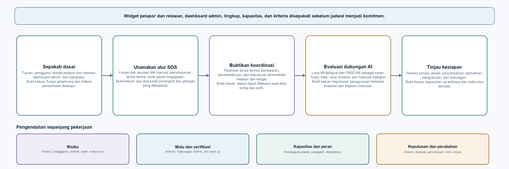

# BAB 2: MANAJEMEN PROYEK

## 2.1 Tujuan dan Landasan Pengelolaan

Bab ini menjelaskan cara mengatur pekerjaan Commencys agar tujuan, batas, tanggung jawab, risiko, mutu, dan keputusan jadwal dapat ditinjau bersama. Commencys dirancang sebagai prototipe tanggap darurat dini berbasis komunitas. Tujuan proyek ialah membantu warga menyampaikan laporan berlokasi dan mendukung koordinasi awal antara pelapor, relawan, dan admin. Admin menjalankan fungsi operator melalui dashboard; operator bukan peran akun yang terpisah. Prototipe ini memiliki batas penggunaan yang jelas dan tidak menggantikan layanan tanggap darurat resmi.

Rencana perlu membedakan **sasaran**, **keputusan yang telah disetujui**, dan **hasil yang sudah diverifikasi**. Prioritas, perkiraan usaha, dan pembagian peran masih perlu disepakati oleh tim sebelum menjadi komitmen kerja.

Pengelolaan proyek menimbang ruang lingkup, biaya, waktu, dan mutu secara bersamaan. Perubahan pada satu unsur dapat memengaruhi unsur lain. Tim perlu menetapkan kemampuan inti dan kriteria penerimaannya terlebih dahulu, mengestimasi pekerjaan setelah dependensi diketahui, lalu menyesuaikan jadwal terhadap kapasitas nyata. Rencana proyek juga memerlukan mekanisme untuk risiko, komunikasi, mutu, dan perubahan [1][2].

## 2.2 Tujuan, Pengguna, dan Batas Lingkup

Pengguna yang dituju terdiri atas **warga pelapor**, **relawan**, dan **admin**. Warga mengirim keterangan serta lokasi kejadian. Relawan melihat penawaran pada widget dan memilih untuk menerima atau menolak tugas. Admin memeriksa laporan serta saran analisis, mengoordinasikan penawaran tugas, dan mengelola akses melalui dashboard admin.

Ruang lingkup inti dimulai dari pengiriman SOS, pemeriksaan lokasi, penyimpanan laporan, tanda terima, dan peninjauan oleh admin. Pemberitahuan, penerimaan atau penolakan tugas dari widget relawan, pencarian laporan terkait, serta informasi rute merupakan kemampuan yang harus mengikuti definisi kewenangan dan kriteria keselamatan. Prototipe akademik tidak menjanjikan ketersediaan relawan, waktu tiba, jangkauan nasional, atau integrasi langsung dengan dispatch pemerintah.

Antarmuka ditetapkan terpisah menurut tugas penggunanya. Widget Android pelapor menjadi pintu masuk laporan dan SOS; widget relawan menampilkan tugas serta pilihan menerima atau menolak. Admin memakai dashboard untuk peninjauan dan koordinasi. Widget bukan website atau HUD, sedangkan dashboard tidak menggantikan antarmuka pengguna. Flutter dapat menjadi wadah alur pelaporan setelah pelapor membuka widget. Teknologi dashboard dapat diputuskan tim, tetapi antarmuka tidak diperlakukan sebagai pilihan yang saling menggantikan.

Lingkup juga perlu menyatakan fungsi yang tidak menjadi jalur kritis. Embedding dan penyimpanan vektor, LLM generatif, retrieval-augmented generation, serta agen otomatis tidak diperlukan untuk menerima SOS atau mengirim pemberitahuan awal. Fitur tersebut dapat dinilai kemudian untuk pencarian SOP atau dukungan baca-saja, dengan sumber yang dapat dilacak dan peninjauan manusia.

## 2.3 Hasil Iterasi Awal dan Kriteria Penerimaan

Iterasi pertama disarankan berfokus pada alur SOS yang dapat diperiksa dari perangkat pelapor sampai tanda terima sistem. Batas ini membantu tim menuntaskan satu hasil inti sebelum mengerjakan seluruh kemampuan analisis dan operasional.

| Hasil yang dituju | Kriteria penerimaan yang perlu disepakati |
|---|---|
| Pengiriman SOS | Pelapor dapat mengirim ringkasan kejadian, waktu, dan lokasi. Kegagalan validasi atau jaringan menghasilkan pesan yang dapat dipahami dan tidak menyatakan laporan berhasil. |
| Kualitas lokasi | Sistem menyimpan koordinat bersama sumber dan nilai akurasi. Jika GPS tidak tersedia atau tidak memadai, pelapor dapat memilih titik secara manual. |
| Penyimpanan dan tanda terima | Laporan sumber disimpan sebelum sistem mengirim tanda terima. Draf menetapkan sasaran di bawah lima detik; titik awal dan akhir pengukuran, perangkat, jaringan, jumlah percobaan, serta ambang penerimaan perlu ditentukan lebih dahulu. Sasaran ini bukan hasil pengukuran. |
| Urgensi awal | Draf mengusulkan urgensi tinggi untuk SOS. Arti label, aturan eskalasi, dan pihak yang berwenang mengubahnya harus disepakati. Model tidak boleh menurunkan urgensi kritis secara otomatis. |
| Analisis pendukung | Keterlambatan atau kegagalan Laya Multilingual dan DBSCAN tidak menghalangi penyimpanan maupun penanganan awal. Keluaran model menjadi saran, sedangkan DBSCAN menghasilkan kandidat laporan terkait. |
| Pemisahan antarmuka | Widget pelapor menyediakan akses ringkas ke laporan dan SOS; widget relawan menyediakan tindakan tugas; dashboard admin mendukung peninjauan dan koordinasi. Tata letak dan tindakan diuji sesuai peran, tanpa elemen dekoratif yang tidak berfungsi. |
| Status komunikasi | Antarmuka membedakan laporan yang diterima sistem, pemberitahuan yang dikirim, tugas yang diterima relawan, dan penanganan yang selesai. Pengiriman WebSocket tidak dengan sendirinya membuktikan bahwa relawan menerima tugas. |
| Pemulihan koneksi | Setelah koneksi WebSocket pulih, klien dapat meminta status terbaru melalui REST. Pengiriman ulang SOS perlu ditangani agar gangguan jaringan tidak membuat laporan ganda tanpa penjelasan. |

Kriteria tersebut perlu dilengkapi dengan skenario gagal, data uji, dan bukti penerimaan. Sebagai contoh, uji lokasi mencakup izin GPS ditolak, layanan lokasi mati, koordinat kurang akurat, serta pemilihan titik manual. Uji tanda terima mencatat kapan pengguna mengirim laporan dan kapan sistem menyatakan laporan telah tersimpan. Hasil harus dilaporkan sesuai lingkungan pengujian, bukan diperluas menjadi jaminan produksi.

## 2.4 Perubahan Usulan Model dan Batas Penggunaannya

Rancangan awal mengusulkan IndoBERT untuk membantu klasifikasi teks. Kelompok kini mengajukan **Laya Multilingual** sebagai kandidat pengganti. Kartu model membedakan checkpoint `convaiinnovations/laya`, yang ditujukan untuk bahasa Inggris, dari `convaiinnovations/laya-multilingual`, yang dirancang untuk banyak bahasa [3]. Informasi tersebut belum membuktikan kinerja pada laporan Commencys berbahasa Indonesia. Perubahan ini merupakan usulan model yang perlu diuji, bukan bukti bahwa Laya lebih akurat daripada IndoBERT.

Laya Multilingual menerima teks dan pertanyaan bertipe, lalu menghasilkan jawaban terstruktur beserta probabilitas. Kartu model melaporkan hasil mendekati tebakan acak untuk keputusan bertipe tanpa pelatihan khusus, serta menyatakan bahwa probabilitasnya belum terkalibrasi. Kartu tersebut juga memperingatkan bahwa pertanyaan dengan skor berurutan merupakan salah satu jenis tugas yang lebih lemah [3]. Karena itu, tim perlu menetapkan kategori dan definisi urgensi yang jelas, kemudian mengevaluasi model dengan laporan Indonesia beranotasi. Nilai keyakinan atau skor urgensi tidak boleh digunakan sendiri untuk menyimpulkan laporan aman atau menurunkan urgensi.

Dalam rancangan Commencys, Laya berjalan setelah laporan tersimpan dan hanya memberi saran kategori. SOS tetap berurgensi awal tinggi; model tidak menurunkannya otomatis. Admin meninjau hasil yang meragukan, sedangkan keterlambatan atau kegagalan model tidak menghentikan penerimaan laporan. Sebelum dipakai, tim perlu menguji data yang mewakili ragam laporan setempat, melaporkan hasil per kategori, memeriksa laporan kritis yang terlewat, menetapkan kalibrasi pada data terpisah, serta menyediakan pencatatan versi dan cara kembali ke model sebelumnya. DBSCAN tetap menjadi proses terpisah untuk mencari kandidat laporan yang berdekatan dalam ruang dan waktu.

DBSCAN menghasilkan kandidat keterkaitan, bukan alasan untuk menghapus atau melebur laporan. Setiap laporan tetap memiliki teks, kategori, urgensi, dan hasil analisisnya sendiri. Jika tim kelak menyetujui ringkasan kelompok, urgensi tertinggi yang belum selesai dapat ditampilkan sebagai petunjuk sementara. Ringkasan tersebut tidak mengganti nilai pada laporan sumber. Hubungan antarlaporan perlu dapat dikoreksi atau dipisahkan oleh admin.

Catatan analisis sebaiknya memuat pengenal laporan, versi model atau algoritma, keluaran, waktu, ambang atau parameter yang digunakan, serta hasil peninjauan. Koreksi admin dicatat bersama nilai sebelum dan sesudah perubahan, alasan, waktu, dan pihak yang meninjau. Koreksi tidak otomatis menjadi label pelatihan. Data hanya dimasukkan ke evaluasi atau pelatihan setelah proses peninjauan yang disepakati; akses terhadap identitas dan koordinat perlu dibatasi sesuai tujuan.

## 2.5 Organisasi Kerja dan Komunikasi

Setiap hasil kerja memerlukan seorang **penanggung jawab utama** dan seorang **pengganti atau peninjau**. Nama anggota perlu ditetapkan oleh tim berdasarkan kesediaan, kompetensi, dependensi, dan beban [1][2].

| Tanggung jawab | Cakupan |
|---|---|
| Koordinasi proyek | Menjaga prioritas, dependensi, keputusan, risiko, dan komunikasi antartugas. |
| Kebutuhan dan rancangan | Menjaga konsistensi tujuan pengguna, kriteria penerimaan, batas sistem, serta diagram. |
| Widget pelapor | Menjaga widget ringkas sebagai pintu masuk ke laporan dan SOS, serta memeriksa perilakunya pada perangkat Android yang dipilih. |
| Widget relawan | Menjaga tampilan penawaran tugas dan tindakan menerima atau menolak agar memakai identitas relawan yang benar. |
| Dashboard admin | Menjaga antrean peninjauan, koreksi, dan pemantauan koordinasi sesuai kontrak layanan dan hak akses yang disetujui. |
| API dan data | Menentukan kontrak API, penyimpanan, akses, pencatatan perubahan, serta pemulihan. |
| Analisis AI dan evaluasi | Menyiapkan taksonomi, data yang ditinjau, metrik, pemeriksaan hasil, dan proses koreksi. |
| Verifikasi dan kesiapan | Menetapkan lingkungan uji, mengumpulkan bukti, mencatat risiko tersisa, serta meninjau batas penggunaan. |

Seorang anggota dapat memegang lebih dari satu tanggung jawab sesuai kapasitas. Namun, keputusan yang berdampak pada keselamatan, akses data, atau penerimaan hasil memerlukan peninjau lain. Setiap penugasan mencatat hasil yang diharapkan, kriteria selesai, dependensi, penanggung jawab, pengganti, dan waktu peninjauan.

Rapat perencanaan menetapkan sasaran dan batas pekerjaan. Tinjauan berkala memeriksa hasil terhadap bukti penerimaan, hambatan, perubahan risiko, dan pekerjaan berikutnya. Catatan rapat memuat keputusan, alasan, tindakan, pemilik, dan tenggat yang disepakati. Evaluasi cara kerja menetapkan perbaikan yang dapat diperiksa. Ritme dan bentuk tinjauan disesuaikan dengan kapasitas tim.

## 2.6 Paket Kerja dan Urutan Hasil

Paket kerja berikut membagi sasaran proyek menjadi keluaran yang dapat ditinjau. Urutannya menunjukkan dependensi logis, bukan tanggal kalender. Tahap berikutnya dapat disesuaikan jika tim memilih lingkup yang lebih kecil, tetapi prasyarat keselamatan dan mutu tetap perlu diperiksa [1][2].

1. **Sepakati dasar proyek.** Tetapkan sasaran, pengguna, batas prototipe, pemisahan widget pelapor, widget relawan, dan dashboard admin, kapasitas, kriteria penerimaan, kebijakan lokasi, dan keputusan yang masih terbuka.
2. **Buktikan alur SOS.** Selesaikan kontrak data, lokasi dan nilai akurasinya, titik manual, penyimpanan, tanda terima, pesan kegagalan, dan prosedur pengiriman ulang.
3. **Buktikan koordinasi.** Definisikan penerima yang berwenang, status pemberitahuan, alur relawan menerima atau menolak tugas dari widget, pembaruan melalui WebSocket, pemulihan melalui REST, serta penyimpanan status yang diperlukan.
4. **Evaluasi analisis pendukung.** Setujui taksonomi dan data evaluasi sebelum menguji Laya Multilingual atau DBSCAN. Pastikan kegagalan analisis tidak menghentikan alur SOS dan hasil yang meragukan dapat ditinjau.
5. **Tinjau kesiapan uji terbatas.** Periksa akses dan privasi, pemulihan data, ketergantungan layanan peta atau rute, pemantauan, prosedur dukungan, dan risiko sisa. Keputusan kesiapan didasarkan pada bukti, bukan kelengkapan daftar fitur.

Gambar 2.1 merangkum urutan tersebut dan menunjukkan pekerjaan pengendalian yang perlu berlangsung sepanjang proyek. Gambar ini adalah peta perencanaan, bukan diagram UML dan bukan jadwal yang sudah disahkan.

*Gambar 2.1. Urutan kerja dan gerbang keputusan proyek Commencys.*

## 2.7 Intisari Pembahasan Trello

Catatan Trello mengarahkan iterasi awal pada alur SOS yang dapat diandalkan: lokasi harus dapat diperiksa dan memiliki pilihan manual, laporan disimpan sebelum tanda terima, serta status pemberitahuan dibedakan dari penerimaan tugas. Kegagalan GPS, jaringan, atau analisis tidak boleh membuat aplikasi menyatakan laporan berhasil jika belum tersimpan, dan tidak boleh menghentikan penanganan awal.

Pekerjaan dibagi menurut tanggung jawab, dengan penanggung jawab dan peninjau atau pengganti. Jadwal dan estimasi baru dapat ditetapkan setelah lingkup, dependensi, dan kapasitas anggota disepakati. Untuk analisis, laporan yang terhubung tetap disimpan terpisah; hasil model dapat dikoreksi oleh admin dan perlu jejak yang dapat ditinjau. Urutan ini merangkum usulan kerja, bukan keputusan atau tenggat yang telah disahkan.

### Tangkapan layar Trello

Nama pada tangkapan layar mengikuti nama papan sumber. Nama proyek dalam naskah ini adalah **Commencys**.

*Gambar 2.2. 1st Trello Documentation.*

*Gambar 2.3. 2nd Trello Documentation.*

*Gambar 2.4. 3rd Trello Documentation.*

*Gambar 2.5. 4th Trello Documentation.*

*Gambar 2.6. 5th Trello Documentation.*

## 2.8 Risiko dan Respons

Risiko ditinjau berulang kali. Untuk setiap risiko, tim mencatat pemicu, dampak, pemilik, respons, bukti pengurangan, dan risiko sisa. Daftar risiko tidak dianggap selesai karena mitigasi sudah ditulis; risiko ditutup setelah tim meninjau bukti yang relevan [1][2].

| Risiko | Respons yang direncanakan dan bukti yang perlu dicari |
|---|---|
| GPS ditolak, mati, atau tidak akurat | Uji izin, ketepatan, sumber koordinat, dan titik manual pada perangkat yang dipilih. Tampilkan keterbatasan lokasi. |
| Laporan hilang atau tidak tersimpan | Simpan laporan sebelum tanda terima. Uji kegagalan layanan, pemulihan, dan proses penyimpanan sesuai lingkup uji. |
| Koordinat presisi atau identitas terbuka kepada pihak yang tidak berwenang | Setujui matriks akses, minimalkan data, tentukan retensi, dan uji akses yang diizinkan maupun ditolak sebelum uji terbatas. |
| Laya Multilingual salah mengategorikan laporan atau terlalu yakin pada hasilnya | Uji pada laporan Indonesia yang ditinjau, kalibrasi skor pada data terpisah, periksa laporan kritis yang terlewat, pertahankan tinjauan manusia, dan siapkan cara menonaktifkan atau mengembalikan versi model. |
| DBSCAN mengaitkan laporan yang berbeda | Uji pasangan laporan yang sama dan berbeda. Pertahankan laporan sumber dan sediakan koreksi atau pemisahan hubungan. |
| WebSocket terputus atau status terlambat | Sediakan pemulihan koneksi dan sinkronisasi ulang melalui REST. Uji status ketika klien luring dan kembali daring. |
| SOS terkirim berulang setelah jeda jaringan | Tentukan perilaku pengiriman ulang dan uji pencegahan laporan ganda serta pesan status kepada pengguna. |
| ETA disalahartikan sebagai janji tiba | Sajikan ETA sebagai perkiraan, jelaskan sumber dan batasnya, dan sembunyikan jika layanan rute tidak tersedia atau belum tervalidasi. |
| Lingkup melampaui kapasitas dan waktu | Prioritaskan alur inti, perbarui perkiraan, tinjau dependensi, dan tunda kemampuan pilihan dengan keputusan yang dicatat. |

## 2.9 Mutu, Pengukuran, dan Kesiapan

Setiap ukuran mutu memerlukan definisi, lingkungan, sumber data, jumlah pengamatan, ambang penerimaan, pemilik, dan cara melaporkan hasil. Sasaran kurang dari lima detik, misalnya, baru dapat ditafsirkan setelah titik ukur ditetapkan. Waktu dari tombol ditekan sampai tiket tersimpan berbeda dari waktu sampai relawan menerima tugas. Hasil uji lokal, uji perangkat, uji beban, dan pengamatan lapangan juga harus dilaporkan terpisah [1][2].

| Aspek | Bukti penerimaan |
|---|---|
| Kecepatan tanda terima | Pengukuran yang berulang dari pengiriman sampai laporan tersimpan pada lingkungan dan jaringan yang didefinisikan. |
| Kualitas lokasi | Sumber koordinat, nilai akurasi, tingkat kegagalan GPS, serta keberhasilan pemilihan manual. |
| Kesesuaian antarmuka | Widget pelapor dan relawan tetap ringkas; dashboard admin berisi tindakan peninjauan dan koordinasi tanpa mengambil keputusan relawan. |
| Klasifikasi teks | Hasil per kategori pada data uji Indonesia yang ditinjau, pemeriksaan laporan kritis yang terlewat, dan kalibrasi terpisah sebelum skor dipakai sebagai informasi keyakinan. |
| Pengelompokan laporan | Kesalahan pengaitan dan laporan berulang yang terlewat, serta keberhasilan admin memperbaiki tautan. |
| Pengiriman dan penerimaan tugas | Status yang terpisah untuk tanda terima, pemberitahuan, penerimaan tugas, dan penyelesaian. |
| Privasi dan akses | Hasil uji hak akses, pencatatan perubahan, retensi, dan penghapusan sesuai kebijakan yang disetujui. |
| Rute dan ETA | Ketersediaan layanan, sumber data rute, batas pengukuran, serta perbandingan terhadap perjalanan yang diamati. |

Data koordinat, laporan insiden, dan identitas memerlukan pembatasan tujuan serta akses. Kebijakan pemrosesan dan masa simpan data perlu ditelaah sebelum uji terbatas. Uji tersebut juga memerlukan batas wilayah, pihak yang berwenang, prosedur jika layanan gagal, saluran pelaporan masalah, dan keputusan untuk menghentikan uji bila kondisi tidak aman.

## 2.10 Pengendalian Perubahan dan Keluaran Manajemen

Kebutuhan, keputusan platform, kriteria penerimaan, rancangan, kontrak API, data evaluasi, konfigurasi, dan hasil uji perlu memiliki versi serta penanggung jawab. Usulan perubahan mencatat alasan, sumber, dampak pada pengguna dan komponen, pengaruh terhadap risiko serta jadwal, dan pihak yang menyetujui. Acuan kerja diperbarui setelah perubahan ditinjau [1][2].

Keluaran manajemen yang perlu dipelihara meliputi **pernyataan lingkup, pembagian tanggung jawab, paket kerja, estimasi dan asumsi, jadwal, daftar risiko, kriteria mutu, catatan keputusan, serta bukti verifikasi**. Keluaran tersebut membantu tim membedakan pekerjaan yang direncanakan dari pekerjaan yang telah diterima. Untuk tugas berikutnya, hasil pengelolaan ini menjadi konteks bagi pemodelan UML: aktor, tujuan, alur interaksi, dan batas komponen perlu konsisten dengan lingkup serta keputusan yang disetujui.

## Daftar Pustaka

[1] E. J. Braude, *Software Engineering: An Object-Oriented Perspective*. New York: John Wiley & Sons, 2001. ISBN 0-471-32208-3. [Wiley Online Library](https://onlinelibrary.wiley.com/doi/abs/10.1002/swf.35).

[2] Project Management Institute, *A Guide to the Project Management Body of Knowledge (PMBOK Guide)*, edisi ke-8. Project Management Institute, 2025. [PMI](https://www.pmi.org/standards/pmbok).

[3] Convai Innovations, *Laya Multilingual*, kartu model Hugging Face, diakses 7 Oktober 2026. [Kartu model](https://huggingface.co/convaiinnovations/laya-multilingual).
