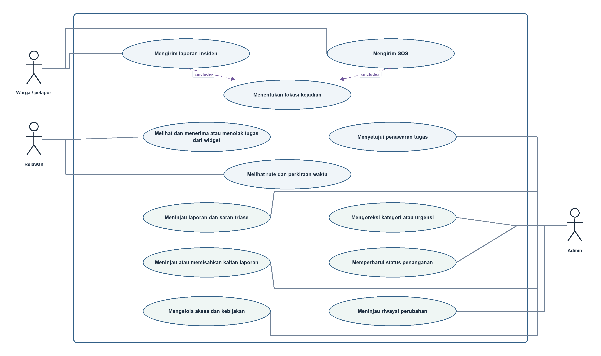
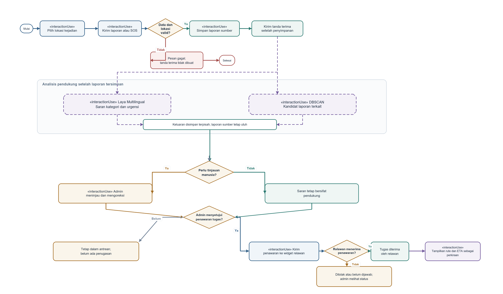
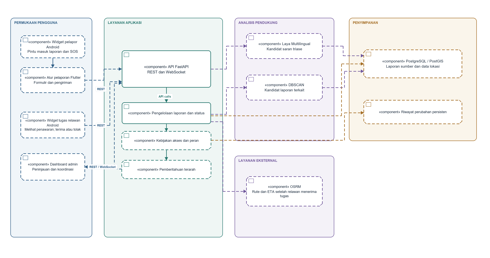

# BAB 3: PEMODELAN SISTEM DENGAN UML

Bab ini menjelaskan rancangan Commencys melalui tiga sudut pandang: tujuan pengguna, urutan interaksi, dan susunan komponen perangkat lunak. Ketiganya saling melengkapi. Diagram use case menjelaskan siapa yang menggunakan sistem dan untuk tujuan apa. *Interaction Overview Diagram* (IOD) merangkum alur dan keputusan dalam skenario. Diagram komponen memperlihatkan bagian perangkat lunak dan hubungan ketergantungannya. Pemodelan tersebut mengikuti prinsip bahwa satu diagram tidak menjelaskan seluruh kebutuhan dan rancangan sistem [1][2].

Diagram pada bab ini merupakan **model sasaran**. Diagram menjelaskan perilaku yang perlu dirancang untuk Commencys, bukan pernyataan bahwa semua peran, layanan, atau integrasi telah dibangun dan diverifikasi. Istilah *Laya Multilingual* menandai usulan model yang perlu dievaluasi untuk laporan berbahasa Indonesia. Hasilnya hanya menjadi saran triase. DBSCAN menghasilkan kandidat laporan yang mungkin berkaitan; proses itu tidak menggabungkan atau menghapus laporan asal.

## 3.1 Diagram Use Case

Gambar 3.1 menempatkan Commencys di dalam batas sistem dan menghubungkan tiga aktor dengan tujuan mereka. Warga atau pelapor mengirim laporan insiden maupun SOS dengan lokasi kejadian. Relawan melihat penawaran pada widget, lalu memilih menerima atau menolak tugas. Admin menggunakan dashboard untuk meninjau laporan dan saran triase, memperbaiki metadata, memeriksa kaitan antarlaporan, memperbarui status, mengelola akses, dan meninjau riwayat perubahan. Istilah operator hanya menjelaskan fungsi admin pada dashboard, bukan aktor tambahan.

Hubungan `include` dari pengiriman laporan dan SOS ke penentuan lokasi menunjukkan bahwa lokasi menjadi bagian dari kedua tujuan tersebut. Lokasi dapat berasal dari GPS atau titik yang dipilih pada peta. Hubungan aktor dengan use case menyatakan keterlibatan yang direncanakan. Hubungan itu tidak membuktikan bahwa akun, kewenangan, atau pembatasan akses sudah tersedia. Makna aktor dan relasi use case mengikuti pemodelan tujuan pada UML [1][2].

**Gambar 3.1. Diagram use case sasaran Commencys.**

Diagram ini menempatkan rute dan perkiraan waktu sebagai tujuan relawan setelah penugasan diterima. Perkiraan waktu tidak berarti janji kedatangan. Saran Laya juga tidak menjadi tindakan aktor otomatis; admin tetap meninjau informasi yang meragukan dan memutuskan tindak lanjut. Dengan demikian, kategori, tingkat urgensi, penerimaan tugas, dan penyelesaian penanganan tetap merupakan hal yang berbeda.

## 3.2 Diagram Ikhtisar Interaksi

Gambar 3.2 memperlihatkan alur sasaran sejak pelapor memilih lokasi hingga relawan menerima atau menolak penawaran melalui widget. Diagram ini merangkum *Interaction Overview Diagram* (IOD) dengan alur kontrol, percabangan, dan tahap interaksi. Simpul berlabel `«interactionUse»` menandai tahap yang dapat dirinci sebagai interaksi tersendiri. Karena Mermaid menyajikannya sebagai flowchart, gambar ini merupakan visualisasi ringkas IOD, bukan model UML native yang dapat menggantikan berkas model dari perangkat pemodelan UML [1][2][3].

Alur dimulai dengan validasi data dan lokasi. Jika masukan tidak valid, sistem memberi pesan kegagalan dan tidak membuat tanda terima. Jika valid, sistem menyimpan laporan sumber terlebih dahulu dan baru kemudian mengirim tanda terima. Sesudah penyimpanan, Laya Multilingual dapat menghasilkan saran kategori atau urgensi, sedangkan DBSCAN mencari kandidat laporan berdasarkan kedekatan ruang dan waktu. Kedua analisis merupakan proses pendukung yang terpisah. Kegagalan atau keterlambatan analisis tidak membatalkan laporan yang sudah tersimpan dan tidak boleh menahan tanda terima.

Admin meninjau keluaran yang memerlukan pemeriksaan. Perubahan kategori atau urgensi tidak menimpa keterangan asli pelapor. Kaitan laporan yang keliru dapat dipisahkan tanpa menghapus laporan sumber. Setelah itu, admin menentukan apakah penawaran tugas perlu dikirim. Relawan melihat penawaran melalui widget dan menentukan sendiri apakah tugas diterima. Pemberitahuan yang terkirim tetap berbeda dari keputusan tersebut. Bila tugas ditolak atau belum dijawab, tugas tidak ditandai selesai dan admin dapat meninjau statusnya.

**Gambar 3.2. Diagram ikhtisar interaksi pengiriman SOS dan koordinasi.**

Status komunikasi dan penanganan berikut perlu tetap dibedakan sepanjang alur:

| Status | Arti dalam rancangan |
|---|---|
| Tanda terima | Laporan telah tersimpan dan diterima oleh sistem. |
| Pemberitahuan | Sistem telah mengirim pemberitahuan kepada penerima yang dituju. Hal ini tidak membuktikan pesan dibaca. |
| Penugasan diterima | Relawan menyatakan secara eksplisit bahwa ia menerima tugas. |
| Penugasan ditolak | Relawan menolak penawaran; laporan tetap terbuka untuk tindak lanjut admin. |
| Penanganan selesai | Pihak berwenang mencatat bahwa proses penanganan telah berakhir; peran yang berwenang perlu disepakati. |

Rute dan ETA baru disajikan setelah relawan menerima penugasan. Keduanya tetap berupa informasi perkiraan. Diagram ini tidak menetapkan tenggat, kapasitas tim, atau jaminan bahwa relawan akan menerima tugas.

## 3.3 Diagram Komponen

Gambar 3.3 menunjukkan batas komponen pada rancangan sasaran. Widget pelapor membuka alur laporan dan SOS; Flutter dapat menjadi wadah alur tersebut setelah widget dibuka. Widget relawan menampilkan penawaran dan meneruskan keputusan terautentikasi untuk menerima atau menolak tugas. Admin menggunakan dashboard terpisah untuk meninjau laporan dan mengelola tindak lanjut. Ketiga permukaan berkomunikasi dengan API sesuai kewenangannya. Kebijakan akses tetap perlu dirancang.

Penyimpanan PostgreSQL dan PostGIS direncanakan untuk laporan sumber dan data lokasi. Riwayat perubahan persisten mendukung peninjauan atas pembaruan. Laya Multilingual hanya menyumbangkan saran triase. DBSCAN hanya menghasilkan kandidat kaitan. Kedua hasil disimpan sebagai informasi pendukung yang dapat ditinjau, terpisah dari keterangan asli. Pemberitahuan terarah memerlukan keputusan tentang penerima dan makna tanda terima. OSRM digunakan untuk rute setelah penugasan diterima; ETA tetap merupakan perkiraan.

Panah menunjukkan arah ketergantungan atau pertukaran data. Garis putus-putus menunjukkan integrasi sasaran atau keputusan teknis yang belum disahkan. Susunan ini bukan bukti bahwa basis data, kontrol peran, model AI, pengiriman terarah, atau layanan rute telah diterapkan. Pemisahan komponen dan hubungan ketergantungannya mengikuti pemodelan arsitektur perangkat lunak [1][2].

**Gambar 3.3. Diagram komponen sasaran Commencys.**

## 3.4 Konsistensi dan Keputusan yang Perlu Diselesaikan

Ketiga diagram menggunakan batas dan istilah yang sama. Pengiriman laporan serta SOS pada diagram use case menjadi titik awal IOD. Penyimpanan terjadi sebelum analisis dan tanda terima tidak disamakan dengan pemberitahuan. Saran Laya dan kandidat DBSCAN muncul sebagai keluaran pendukung pada IOD serta sebagai komponen terpisah pada diagram komponen. Admin meninjau hasil, sedangkan relawan menyatakan penerimaan atau penolakan melalui widget. OSRM baru relevan setelah penerimaan tersebut.

Sebelum rancangan menjadi dasar implementasi, tim perlu merinci integrasi widget pelapor dan relawan, autentikasi relawan pada tindakan widget, teknologi dashboard admin, definisi peran dan hak akses, penerima serta bukti pengiriman pemberitahuan, taksonomi dan data evaluasi Laya, parameter dan cara koreksi DBSCAN, penyimpanan serta masa retensi data, dan sumber rute serta batas penggunaan ETA. Keputusan tersebut perlu disertai kriteria penerimaan dan bukti verifikasi sebagaimana dibahas pada Bab 2.

## Daftar Pustaka

[1] E. J. Braude, *Software Engineering: An Object-Oriented Perspective*. New York: John Wiley & Sons, 2001. ISBN 0-471-32208-3. [Wiley Online Library](https://onlinelibrary.wiley.com/doi/abs/10.1002/swf.35).

[2] Object Management Group, *Unified Modeling Language (UML), Version 2.5.1*, Desember 2017. [Spesifikasi UML](https://www.omg.org/spec/UML/2.5.1/PDF).

[3] Mermaid, *Use Case and Flowchart Syntax Documentation*, diakses 7 Oktober 2026. [Use case](https://mermaid.js.org/syntax/usecase.html); [flowchart](https://mermaid.js.org/syntax/flowchart.html).
