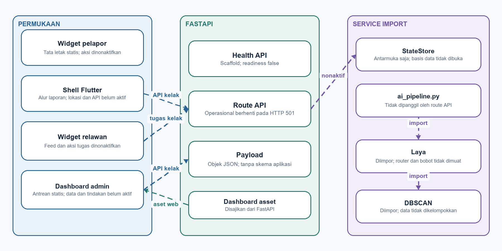
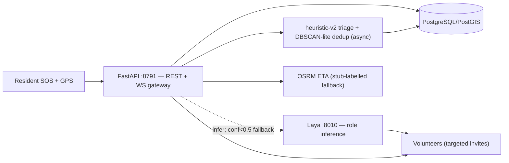

# Commencys — Community Emergency Response Platform

   

Community early-response platform (**Commencys**): one-tap SOS with GPS,
incident reporting, geospatial alerts, WebSocket coordination, and an OSM map
(Flutter `flutter_map`), backed by a **FastAPI** service (v1.2.0 + dispatch
work) with heuristic-v2 AI triage + DBSCAN-lite dedup, **Laya agent
dispatch-auto**, a volunteer registry with targeted role invites, review
queue + coordinator correct/split, an immutable audit trail, PostGIS-ready
storage, and OSRM-labelled ETAs.

> Community early-response aid — **not** a substitute for official emergency
> services (112 / SPGDT 119).

## Live topology

| Service | Address |
|---------|---------|
| Backend (FastAPI, systemd `commencys-backend`) | `http://100.89.180.23:8791` (Tailnet, `0.0.0.0:8791`) |
| Laya dispatch agent (systemd `laya-api`) | `http://127.0.0.1:8010` (`/health`, `POST /v1/systemone`; `LAYA_BASE_URL` env, 15 s timeout → heuristic fallback, never 5xx) |
| Mobile default | CI bakes `--dart-define=API_BASE=http://100.89.180.23:8791` (works on the Tailnet out of the box; overridable in-app via the server icon) |

## Contributors

| Name | Focus |
|------|-------|
| Reinathan Ezkhiel Kurniawan | Mobile / SOS flow |
| Alwahib Raffi Raihan | Map & geolocation |
| Joshua Ricardo Riangkamang | Backend client & alerts |

## Layout

```
lib/
  main.dart                 # MaterialApp + named routes (AppShell, map-as-home)
  models/incident.dart      # Canonical ticket (urgency P1–P4, lifecycle incl. broadcast)
  services/
    api_client.dart         # FastAPI HTTP client (incidents + SOS + dispatch + volunteers, 10 s timeout)
    app_config.dart         # backend base URL (env default, in-app server setting, WS mapping)
    location_service.dart   # geolocator permission + stream + accuracy
    websocket_service.dart  # live channel w/ auto-reconnect + status parsing
  screens/
    home_screen.dart        # dashboard + big SOS entry + backend server setting
    sos_screen.dart         # one-tap SOS + StatusTimeline + 112/119 disclaimer
    report_screen.dart      # incident report form (spec taxonomy)
    map_screen.dart         # flutter_map (OSM) incident pins
    alerts_screen.dart      # live + REST alert feed
  widgets/
    status_timeline.dart    # acknowledged → broadcast → dispatched → resolved
  test/
    incident_test.dart      # 5 tests: WS URL mapping, base-URL normalisation, JSON round-trip, ticket incl. AI metadata, lifecycle order
    invite_test.dart        # 7 tests: targeted-invite parsing, broadcast defaults, role matching, invite round-trip, role ids, registration payload, matchedRoles
backend/
  app/main.py               # FastAPI: SOS/incidents/dispatch-auto/volunteers/review-queue/correct/split/audit/ETA/WS (<5 s ack)
  app/models.py             # Pydantic schemas (taxonomy, P1–P4, lifecycle, sos category, reporter_name, AI urgency fields, Volunteer)
  app/ai_pipeline.py        # heuristic-v2 triage + DBSCAN-lite (0.65 threshold, advisory-only)
  app/laya_dispatch.py      # Laya agent client + keyword fallback (VALID_ROLES, never-blocks dispatch-auto)
  tests/test_api.py         # 24 contract + AI-guard + dispatch tests incl. SOS budget guard
docs/                       # Jekyll Pages site (https://joshriang.github.io/commencys/)
  00-planning.md 01-analysis.md 02-design.md 03-implementation.md
  04-testing.md 05-deployment.md 06-maintenance.md
  ai-stations.md decisions.md api-contract.md db-schema.md
  evaluation-monitoring.md guardrails.md quality.md reference.md
  architecture.mmd architecture.png
android/app/...             # INTERNET + location permissions
```

## Setup

```bash
# Backend
cd backend && pip install -r requirements.txt
uvicorn app.main:app --host 0.0.0.0 --port 8791
pytest -q   # 24/24
# Mobile (needs Flutter SDK)
flutter pub get
flutter analyze
flutter test   # 5/5 + 7/7
flutter run
# Backend address: Tailnet default http://100.89.180.23:8791.
# Phone on the same Tailnet: works out of the box (CI-baked API_BASE),
# or tap the server icon in the app bar to override
# (or bake it in: flutter build apk --release --dart-define=API_BASE=<url>)
# Laya (dispatch-auto role inference): served separately on 127.0.0.1:8010;
# override with LAYA_BASE_URL=http://<host>:8010 (15 s timeout, then fallback).
```

## Install on a phone

1. Grab the latest release APK from CI (`app-release` artifact) or the
   versioned copy in `docs/05-deployment.md`.
2. Install it (Android allows direct APK install after a one-time
   "unknown apps" confirmation).
3. Join the Tailnet (or set the server URL in-app via the server icon,
   top right), then send a test SOS.

## Backend contract (13 REST + 1 WS)

- `GET /health` → `{"status":"ok","service":"commencys-mvp"}`
- `POST /api/sos` → 201 acknowledged P1 ticket (`category: "sos"`), strictly < 5 s
- `POST /api/incidents` → 201 acknowledged ticket
- `GET /api/incidents` → list of tickets
- `POST /api/incidents/{id}/dispatch?volunteer=` → acknowledged/broadcast → dispatched (manual accept, writes `dispatched_to`)
- `POST /api/volunteers` → 201 volunteer (roles must be `VALID_ROLES`, audit `volunteer_register`)
- `GET /api/volunteers?role=&category=` → list + role filter
- `POST /api/incidents/{id}/dispatch-auto` → 200 Laya role inference + targeted invites (writes `required_roles`/`dispatch_source`/`invited`, audit `dispatch_auto`, heuristic fallback when Laya is down)
- `GET /api/review-queue` → coordinator triage inbox (AI-flagged tickets)
- `POST /api/incidents/{id}/correct` → 200 coordinator correction (metadata only, raw immutable; urgency → `coordinator_corrected`)
- `POST /api/incidents/{id}/split` → 200 clear cluster link (reversible dedup)
- `GET /api/audit?incident_id=` → immutable trail (`create/ai_classify/cluster/dispatch/dispatch_auto/volunteer_register/correct/split`)
- `GET /api/eta` → `{source: stub|osrm, distance_m, eta_s}`
- `WS /ws/alerts` → live frames (`incident.sos/created/ai_updated/dispatch_auto/dispatched`)

Full contract: [`docs/api-contract.md`](docs/api-contract.md) ·
DB schema: [`docs/db-schema.md`](docs/db-schema.md).

## Tests

| Suite | Result |
|-------|--------|
| Backend `cd backend && pytest -q` | ✅ 24/24 (contract + SOS budget + AI guards + volunteers/dispatch/Laya) |
| `flutter test` (`incident_test` + `invite_test`) | ✅ 5/5 + 7/7 |
| `flutter analyze` | ✅ clean |

Traceability: [`docs/04-testing.md`](docs/04-testing.md).

## Docs

Start at [`docs/index.md`](docs/index.md) (status: v1.2.0 live + dispatch
work, 24/24 + 5/5 + 7/7 green) or the published site
(https://joshriang.github.io/commencys/), then:

Planning → [`docs/00-planning.md`](docs/00-planning.md) ·
Analysis + gap map → [`docs/01-analysis.md`](docs/01-analysis.md) ·
Design + diagram → [`docs/02-design.md`](docs/02-design.md) ·
9-station AI mapping → [`docs/ai-stations.md`](docs/ai-stations.md) ·
3 decisions → [`docs/decisions.md`](docs/decisions.md) ·
API contract → [`docs/api-contract.md`](docs/api-contract.md) ·
DB schema → [`docs/db-schema.md`](docs/db-schema.md) ·
Eval → [`docs/evaluation-monitoring.md`](docs/evaluation-monitoring.md) ·
Guardrails → [`docs/guardrails.md`](docs/guardrails.md).

Wiki (ops guides: backend API, deployment, Laya dispatch, testing/CI,
volunteer roles): https://github.com/JoshRiang/commencys/wiki.

## Architecture





## CI

GitHub Actions ([`ci.yml`](.github/workflows/ci.yml)): backend job
(`pip install` → `pytest`, 24 tests) + Flutter job
(`pub get` → `analyze` → `test` → `build apk --release`),
publishing the release APK as the `app-release` artifact with
`API_BASE=http://100.89.180.23:8791` baked in.
Docs site via [`pages.yml`](.github/workflows/pages.yml) → GitHub Pages.
