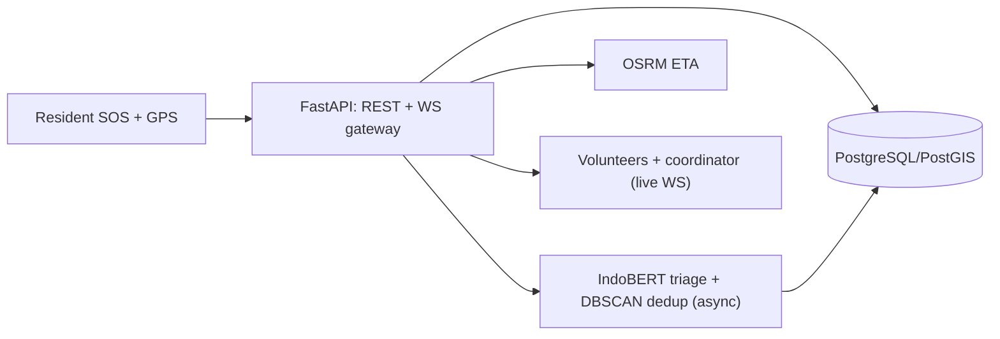

# Commencys — Community Emergency Response Platform

   

Community early-response platform (**Commencys**): one-tap SOS with GPS,
incident reporting, geospatial alerts, WebSocket coordination, and an OSM map
(Flutter `flutter_map`), backed by a **FastAPI** service with async
IndoBERT urgency classification + DBSCAN dedup, PostGIS-ready storage, and
OSRM ETAs.

> Community early-response aid — **not** a substitute for official emergency
> services (112 / SPGDT 119).

## Contributors

| Name | Focus |
|------|-------|
| Reinathan Ezkhiel Kurniawan | Mobile / SOS flow |
| Alwahib Raffi Raihan | Map & geolocation |
| Joshua Ricardo Riangkamang | Backend client & alerts |

## Layout

```
lib/
  main.dart                 # MaterialApp + named routes
  models/incident.dart      # Canonical ticket (urgency P1–P4, lifecycle incl. broadcast)
  services/
    api_client.dart         # FastAPI HTTP client (incidents + SOS + dispatch, 10 s timeout)
    app_config.dart         # backend base URL (env default, in-app server setting, WS mapping)
    location_service.dart   # geolocator permission + stream + accuracy
    websocket_service.dart  # live channel w/ auto-reconnect + status parsing
  screens/
    home_screen.dart        # dashboard + big SOS entry + backend server setting
    sos_screen.dart         # one-tap SOS + StatusTimeline + 112/119 disclaimer
    report_screen.dart      # incident report form (spec taxonomy)
    map_screen.dart         # flutter_map (OSM) incident pins
    alerts_screen.dart      # live + REST alert feed
  widgets/
    status_timeline.dart    # acknowledged → broadcast → dispatched → resolved
backend/
  app/main.py               # FastAPI: SOS/incidents/dispatch/ETA/WS (<5 s ack)
  app/models.py             # Pydantic schemas (taxonomy, P1–P4, lifecycle)
  app/ai_pipeline.py        # async IndoBERT + DBSCAN stubs (0.65 threshold)
  tests/test_api.py         # contract tests incl. SOS budget guard
docs/
  00-planning.md 01-analysis.md 02-design.md 03-implementation.md
  04-testing.md 05-deployment.md 06-maintenance.md
  ai-stations.md decisions.md api-contract.md db-schema.md
  evaluation-monitoring.md guardrails.md
  architecture.mmd architecture.png
android/app/...             # INTERNET + location permissions
```

## Setup

```bash
# Backend
cd backend && pip install -r requirements.txt
uvicorn app.main:app --reload --port 8000
pytest -q
# Mobile (needs Flutter SDK)
flutter pub get
flutter analyze
flutter test
flutter run
# Backend address: emulator default http://10.0.2.2:8000 (host loopback).
# Phone on the same Wi-Fi/LAN: run the backend with
#   uvicorn app.main:app --host 0.0.0.0 --port 8000
# then tap the server icon in the app bar and enter e.g.
#   http://192.168.1.10:8000
# (or bake it in: flutter build apk --release --dart-define=API_BASE=<url>)
```

## Install on a phone

1. Grab the latest release APK from CI (`app-release` artifact) or the
   versioned copy in `docs/05-deployment.md`.
2. Install it (Android allows direct APK install after a one-time
   "unknown apps" confirmation).
3. Start the backend on the same network, set the server URL in-app
   (server icon, top right), then send a test SOS.

## Backend contract

- `POST /api/sos` → 201 acknowledged ticket, strictly < 5 s (P1 fail-safe)
- `POST /api/incidents` → 201 acknowledged ticket
- `GET /api/incidents` → list of tickets
- `POST /api/incidents/{id}/dispatch` → acknowledged/broadcast → dispatched
- `GET /api/eta` → `{source: stub|osrm, distance_m, eta_s}`
- `WS /ws/alerts` → live frames (`incident.sos/created/ai_updated/dispatched`)

Full contract: [`docs/api-contract.md`](docs/api-contract.md).

## Docs

Start at [`docs/README.md`](docs/README.md) (contents + architecture), then:

Planning → [`docs/00-planning.md`](docs/00-planning.md) ·
Analysis + gap map → [`docs/01-analysis.md`](docs/01-analysis.md) ·
Design + diagram → [`docs/02-design.md`](docs/02-design.md) ·
9-station AI mapping → [`docs/ai-stations.md`](docs/ai-stations.md) ·
3 decisions → [`docs/decisions.md`](docs/decisions.md) ·
DB schema → [`docs/db-schema.md`](docs/db-schema.md) ·
Eval → [`docs/evaluation-monitoring.md`](docs/evaluation-monitoring.md) ·
Guardrails → [`docs/guardrails.md`](docs/guardrails.md).

## Architecture




## CI

GitHub Actions ([`ci.yml`](.github/workflows/ci.yml)): backend job
(`pip install` → `pytest`) + Flutter job
(`pub get` → `analyze` → `test` → `build apk --release`),
publishing the release APK as the `app-release` artifact.
