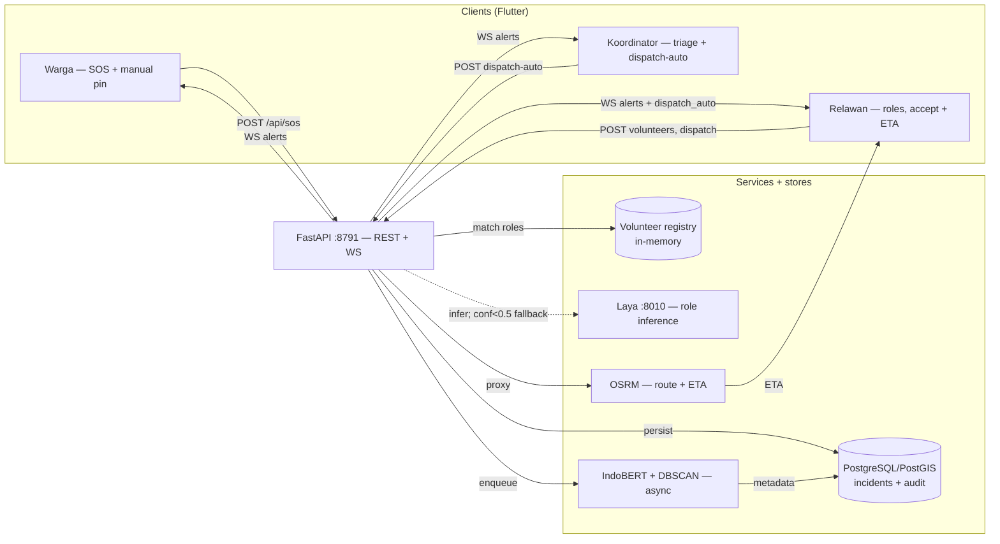

# 02 — System Design

## Architecture

Rendered: `docs/architecture.png` (Mermaid source above is normative; PNG is
a convenience export).

**Hot-path invariant:** `clients → API → DB → WS broadcast` contains no AI
node. AI enriches stored rows afterwards (criterion 4).

## Ticket lifecycle (spec §7 transparency)

`reported → acknowledged → broadcast → dispatched → resolved`

- `acknowledged` = "Laporan Diterima Sistem" (stored, nothing more).
- `broadcast` = notifications fanned out to volunteers.
- `dispatched` = a named volunteer accepted the ticket.
- The UI renders these as a stepper; acknowledged must never be styled as
  dispatched (criterion 3).

## Category taxonomy + urgency (spec station 4)

Categories: `medical` (henti jantung, pingsan, trauma), `accident`
(lalin, jatuh), `fire`, `security` (pencurian, penyerangan/pelecehan),
`facility`/other. Urgency: **P1-Kritis → P4-Rendah**. SOS enters as **P1 by
default** until IndoBERT/human triage refines it — a fail-safe against false
negatives (see `evaluation-monitoring.md`).

## Key flows

1. **SOS:** tap → GPS (+accuracy) → `POST /api/sos` → 201 `acknowledged`
   (< 5 s) → WS `incident.sos` fan-out → background `classify`+`cluster` →
   WS `incident.ai_updated`.
2. **Dispatch:** volunteer taps accept → `POST .../dispatch` → status
   `dispatched` → WS `incident.dispatched` + OSRM ETA to volunteer.
   Targeted variant: coordinator triggers `POST .../dispatch-auto` →
   Laya infers `required_roles` + `headcount` (ID→EN pre-translated,
   `< 0.5` confidence gate → heuristic fallback) → nearest matching
   volunteers invited → WS `incident.dispatch_auto`; stored as ticket
   metadata (`required_roles`/`invited`/`dispatch_source`), manual
   `dispatch` override untouched.
3. **Correction:** coordinator edits label / splits cluster → metadata-only
   update → audit row → WS update.

## Component map (repo)

| Component | Path | Spec role |
|-----------|------|-----------|
| SOS hot path + WS gateway | `backend/app/main.py` | Stations 7 (integration) |
| Schemas (taxonomy, lifecycle) | `backend/app/models.py` | Station 4 |
| Async AI workers | `backend/app/ai_pipeline.py` | Stations 4 (classify) + 2-deferred/DBSCAN dedup |
| Mobile client | `lib/` (screens/services) | Station 7 client |
| Contract / schema / eval / guardrails | `docs/` | Stations 8–9, §2–§4 |
