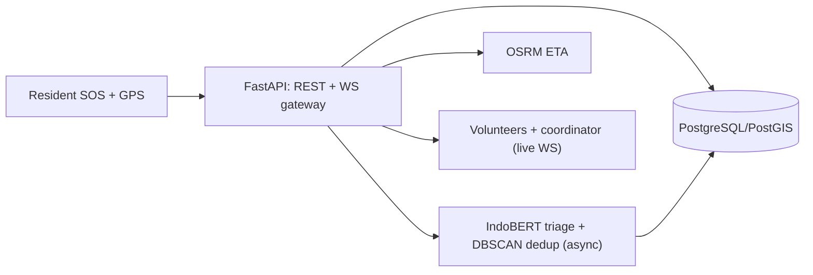

# Commencys docs

Start here: [README](../README.md) · [Architecture](#architecture) ·
[API contract](api-contract.md) · [Phone install](05-deployment.md#phone-install)

## Contents

| # | Doc | What it covers |
|---|-----|----------------|
| 00 | [Planning](00-planning.md) | problem, MVP scope, milestones, risks |
| 01 | [Analysis](01-analysis.md) | user story, gap map, client note |
| 02 | [Design](02-design.md) | lifecycle, architecture diagram, data flow |
| 03 | [Implementation](03-implementation.md) | what was built, file pointers |
| 04 | [Testing](04-testing.md) | test layers, manual QA checklist |
| 05 | [Deployment](05-deployment.md) | backend + phone install, release history |
| 06 | [Maintenance + SOPs](06-maintenance.md) | coordinator SOPs, review cadence |
| — | [AI stations](ai-stations.md) | 9-station AI architecture mapping |
| — | [Decisions](decisions.md) | key technical decisions + trade-offs |
| — | [API contract](api-contract.md) | REST + WebSocket reference |
| — | [DB schema](db-schema.md) | PostgreSQL/PostGIS DDL |
| — | [Evaluation & monitoring](evaluation-monitoring.md) | metrics, targets, instruments |
| — | [Guardrails](guardrails.md) | responsible-AI rules |

## Architecture

Source of truth for the diagram: [`architecture.mmd`](architecture.mmd)
(rendered to [`architecture.png`](architecture.png)).
