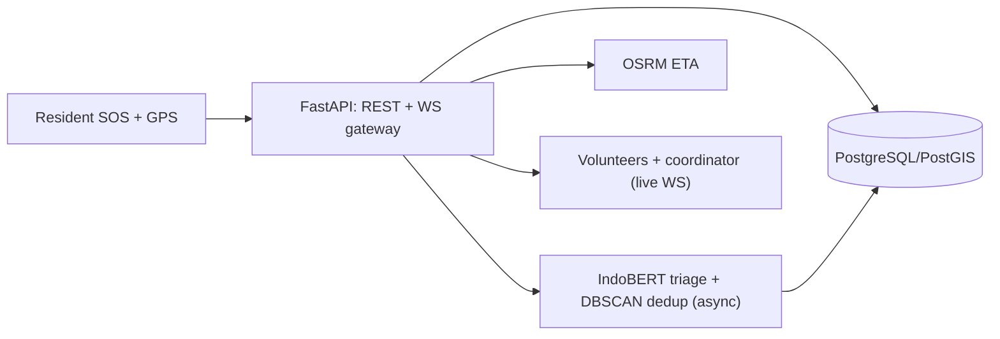

# Commencys docs

Start here: [Home](index.md) · [SDLC — Waterfall](sdlc-waterfall.md) ·
[Repo README](https://github.com/JoshRiang/commencys#readme) ·
[API contract](api-contract.md) ·
[Phone install](05-deployment.md#phone-install)

## Waterfall phases

| # | Doc | What it covers |
|---|-----|----------------|
| 0 | [Planning](00-planning.md) | charter: problem, MVP scope, milestones, risks |
| 1 | [Requirements Analysis](01-analysis.md) | acceptance criteria C1–C4, FR/NFR, gap map |
| 2 | [System Design](02-design.md) | lifecycle, architecture diagram, data flow |
| 3 | [Implementation](03-implementation.md) | what was built, file pointers, reskin `a811497` → map shell `6967487` → AI triage `65409f0` → Laya dispatch `4a94fb6`/`a91d104` + role onboarding `084cb07` → voice SOS + P1 invites (PR #1) |
| 4 | [Verification & Testing](04-testing.md) | test layers (28/28 + 5/5 + 7/7 + 3/3), latest CI evidence, QA checklist |
| 5 | [Deployment](05-deployment.md) | backend + phone install, release history (1.0.0 → 1.3.0) |
| 6 | [Maintenance & SOPs](06-maintenance.md) | coordinator SOPs, review cadence |

## Reference

| Doc | What it covers |
|-----|----------------|
| [API Contract](api-contract.md) | REST + WebSocket reference |
| [DB Schema](db-schema.md) | PostgreSQL/PostGIS DDL |
| [AI Stations Mapping](ai-stations.md) | 9-station AI architecture mapping |
| [Technical Decisions](decisions.md) | key technical decisions + trade-offs |

## Quality & Governance

| Doc | What it covers |
|-----|----------------|
| [Evaluation & Monitoring](evaluation-monitoring.md) | metrics, targets, instruments |
| [Guardrails & Responsible AI](guardrails.md) | responsible-AI rules |

## Architecture

Source of truth for the diagram: [`architecture.mmd`](architecture.mmd)
(rendered to [`architecture.png`](architecture.png)).
