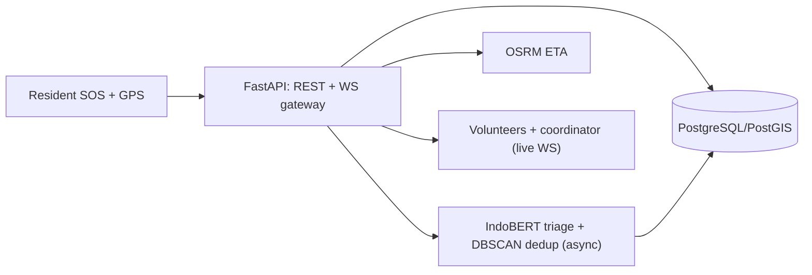

# Commencys Docs


Community early-response platform: **one-tap SOS with GPS**, incident
reporting, geospatial alerts, WebSocket coordination, and an OSM map
(Flutter `flutter_map`), backed by a **FastAPI** service with async
IndoBERT urgency classification + DBSCAN dedup, PostGIS-ready storage,
and OSRM ETAs.

> Community early-response aid — **not** a substitute for official
> emergency services (112 / SPGDT 119).

## Quickstart

```bash
# Backend (needs Python 3.11+)
cd backend && pip install -r requirements.txt
uvicorn app.main:app --reload --port 8000
pytest -q

# Mobile (needs Flutter SDK)
flutter pub get
flutter analyze
flutter test
flutter run
```

Backend address: emulator default `http://10.0.2.2:8000`. Phone on the
same Wi-Fi/LAN — run the backend with
`uvicorn app.main:app --host 0.0.0.0 --port 8000`, tap the server icon
in the app bar, and enter e.g. `http://192.168.1.10:8000`.

**Phone install:** grab the latest release APK from CI (the
`app-release` artifact — versioned copy in
[Deployment](05-deployment.md#phone-install)), allow one-time
"unknown apps" install, start the backend on the same network, set the
server URL in-app, then send a test SOS.

## Architecture




Source of truth: [`architecture.mmd`](https://github.com/JoshRiang/commencys/blob/main/docs/architecture.mmd).
Details in [Design](02-design.md) and [AI stations](ai-stations.md).

## API at a glance

| Method & path | Result |
|---|---|
| `POST /api/sos` | 201 acknowledged ticket, strictly **< 5 s** (P1 fail-safe) |
| `POST /api/incidents` | 201 acknowledged ticket |
| `GET /api/incidents` | List of tickets |
| `POST /api/incidents/{id}/dispatch` | acknowledged/broadcast → dispatched |
| `GET /api/eta` | `{source: stub\|osrm, distance_m, eta_s}` |
| `WS /ws/alerts` | Live frames (`incident.sos/created/ai_updated/dispatched`) |

Full reference: [API contract](api-contract.md). Storage DDL:
[DB schema](db-schema.md).

## Docs map

| # | Doc | What it covers |
|---|-----|----------------|
| 00 | [Planning](00-planning.md) | Problem, MVP scope, milestones, risks |
| 01 | [Analysis](01-analysis.md) | User story, gap map, client note |
| 02 | [Design](02-design.md) | Lifecycle, architecture diagram, data flow |
| 03 | [Implementation](03-implementation.md) | What was built, file pointers |
| 04 | [Testing](04-testing.md) | Test layers, manual QA checklist |
| 05 | [Deployment](05-deployment.md) | Backend + phone install, release history |
| 06 | [Maintenance + SOPs](06-maintenance.md) | Coordinator SOPs, review cadence |
| — | [AI stations](ai-stations.md) | 9-station AI architecture mapping |
| — | [Decisions](decisions.md) | Key technical decisions + trade-offs |
| — | [Evaluation & monitoring](evaluation-monitoring.md) | Metrics, targets, instruments |
| — | [Guardrails](guardrails.md) | Responsible-AI rules |

---

Project repo: [JoshRiang/commencys](https://github.com/JoshRiang/commencys) ·
CI: backend `pytest` + Flutter `analyze`/`test`/release APK build.
