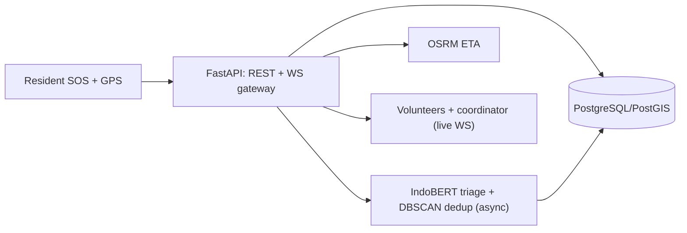

# Commencys — Community Emergency Response Platform


Community early-response platform: **one-tap SOS with GPS**, incident
reporting, geospatial alerts, WebSocket coordination, and an OSM map
(Flutter `flutter_map`), backed by a **FastAPI** service with async
IndoBERT urgency classification + DBSCAN dedup, PostGIS-ready storage,
and OSRM ETAs.

> Community early-response aid — **not** a substitute for official
> emergency services (112 / SPGDT 119).

## At a glance

| | |
|---|---|
| **Platform** | Android app (Flutter) + FastAPI backend |
| **Hot path** | SOS → persist → acknowledge in **strictly < 5 s** (P1 fail-safe, AI never downgrades) |
| **Live channel** | WebSocket `/ws/alerts` with auto-reconnect + REST re-sync |
| **AI** | Heuristic-v2 triage (advisory-only urgency + DBSCAN-lite clustering), async only — never on the SOS path; coordinator review queue + correct/split + audit trail |
| **Map** | Map-as-home liquid-glass shell: `AppShell` + floating glass tab bar, full-bleed live map, in-app server setting |
| **Status** | v1.2.0 live + dispatch work after: backend supervised on `:8791`, CI-baked `API_BASE=http://100.89.180.23:8791`, 24/24 + 5/5 + 7/7 tests green, versioned APKs |
| **Team** | Reinathan Ezkhiel Kurniawan (Mobile / SOS) · Alwahib Raffi Raihan (Map & geolocation) · Joshua Ricardo Riangkamang (Backend client & alerts) |

## How these docs are organized

This documentation follows the **[Waterfall SDLC](sdlc-waterfall.md)**
used to build Commencys — each phase signs off before the next begins:

| Phase | Doc | What it proves |
|-------|-----|----------------|
| 0 · Charter | [Planning](00-planning.md) | Problem, MVP scope, milestones, risks |
| 1 · Requirements | [Requirements Analysis](01-analysis.md) | Acceptance criteria C1–C4, FR/NFR |
| 2 · Design | [System Design](02-design.md) | Architecture, lifecycle, taxonomy |
| 3 · Build | [Implementation](03-implementation.md) | What was built, file by file (incl. map shell `6967487` + AI triage `65409f0`) |
| 4 · Verify | [Verification & Testing](04-testing.md) | Test layers (24/24 + 5/5 + 7/7), traceability, QA |
| 5 · Ship | [Deployment](05-deployment.md) | Backend + phone install, releases (1.0.0 → 1.2.0) |
| 6 · Operate | [Maintenance & SOPs](06-maintenance.md) | Coordinator SOPs, model lifecycle |

Reference appendices: [API contract](api-contract.md) ·
[DB schema](db-schema.md) · [Decisions](decisions.md) ·
[AI stations](ai-stations.md) · [Evaluation](evaluation-monitoring.md) ·
[Guardrails](guardrails.md).

## Quickstart

```bash
# Backend (needs Python 3.11+)
cd backend && pip install -r requirements.txt
uvicorn app.main:app --reload --port 8000   # local dev; live supervised backend serves :8791
pytest -q   # 24/24 (7 contract + 6 AI guards + 11 volunteer/dispatch/Laya guards)

# Mobile (needs Flutter SDK)
flutter pub get
flutter analyze
flutter test
flutter run
```

Backend address: emulator default `http://10.0.2.2:8000`. Release APKs
bake `API_BASE=http://100.89.180.23:8791` (works on the Tailnet out of the
box). Phone on the same Wi-Fi/LAN — run the backend with
`uvicorn app.main:app --host 0.0.0.0 --port 8000`, tap the server icon
in the app bar, and enter e.g. `http://192.168.1.10:8000`.

**Phone install:** grab the latest release APK from
[Deployment](05-deployment.md#release-history), allow one-time
"unknown apps" install, start the backend on the same network, set the
server URL in-app, then send a test SOS.

## Architecture




Source of truth: [`architecture.mmd`](https://github.com/JoshRiang/commencys/blob/main/docs/architecture.mmd).
Details in [System Design](02-design.md) and [AI stations](ai-stations.md).

## API at a glance

| Method & path | Result |
|---|---|
| `POST /api/sos` | 201 acknowledged ticket, strictly **< 5 s** (P1 fail-safe) |
| `POST /api/incidents` | 201 acknowledged ticket |
| `GET /api/incidents` | List of tickets |
| `POST /api/incidents/{id}/dispatch` | acknowledged/broadcast → dispatched |
| `POST /api/incidents/{id}/dispatch-auto` | Laya role/headcount inference + targeted volunteer invites (`laya\|fallback`) |
| `POST /api/volunteers` | register volunteer (canonical role ids, coordinates required) |
| `GET /api/review-queue` | Coordinator triage inbox (`needs_review` tickets) |
| `POST /api/incidents/{id}/correct` | Correct AI label/urgency (raw report immutable; stamps `coordinator_corrected`) |
| `POST /api/incidents/{id}/split` | Undo a false cluster merge |
| `GET /api/audit?incident_id=<id>` | Immutable audit trail (`heuristic-v2`) |
| `GET /api/eta` | `{source: stub\|osrm, distance_m, eta_s}` |
| `WS /ws/alerts` | Live frames (`incident.sos/created/ai_updated/dispatched`) |

Full reference: [API contract](api-contract.md). Storage DDL:
[DB schema](db-schema.md).

---

Project repo: [JoshRiang/commencys](https://github.com/JoshRiang/commencys) ·
CI: backend `pytest` + Flutter `analyze`/`test`/release APK build.
