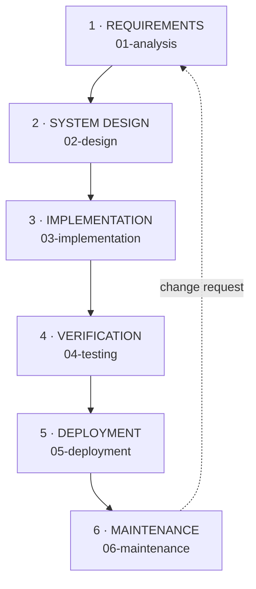

# SDLC — Waterfall Model

**Commencys is built with the Waterfall software development life cycle.**
Each phase finishes completely — with a signed-off deliverable — before the
next begins. This page is the backbone of the documentation: every phase below
is a child page with its entry criteria, deliverables, and exit gate.

## Why Waterfall fits this project

1. **Frozen requirements.** The RPL course spec fixes the acceptance criteria
   (sub-5-second SOS ack, acknowledged ≠ dispatched, AI never blocks SOS)
   up front — there is nothing to "discover" mid-sprint.
2. **Regulated domain.** Emergency response demands traceability: every line
   of code maps back to a requirement, and every requirement maps forward to
   a test. Waterfall's document-per-phase discipline gives that for free.
3. **Small fixed team.** Three developers, fixed roles (see
   [Planning](00-planning.md)) — sequential phases avoid coordination
   overhead.

## The six phases

| # | Phase | Objective | Key deliverable | Doc |
|---|-------|-----------|-----------------|-----|
| 1 | Requirements | Freeze *what* the system must do | Acceptance criteria C1–C4, FR-1–FR-8, NFR-1–NFR-7 | [01-analysis](01-analysis.md) |
| 2 | System Design | Freeze *how* it is built | Architecture, ticket lifecycle, taxonomy, component map | [02-design](02-design.md) |
| 3 | Implementation | Build exactly what was designed | FastAPI backend + Flutter client | [03-implementation](03-implementation.md) |
| 4 | Verification | Prove every requirement holds | Backend + model tests, CI gate, QA checklist | [04-testing](04-testing.md) |
| 5 | Deployment | Ship to real phones + server | Release APK, install runbook, release history | [05-deployment](05-deployment.md) |
| 6 | Maintenance | Operate, monitor, improve | Coordinator SOPs, model lifecycle, incident playbooks | [06-maintenance](06-maintenance.md) |

Phase 0, [Planning](00-planning.md) (problem statement, MVP scope,
milestones, risks), is the project charter that authorises the Waterfall run.

## Phase gates

No phase is entered until the previous gate is signed off:

| Gate | Exit criteria |
|------|---------------|
| G1 Requirements → Design | All 4 acceptance criteria written, testable, and mapped to FR/NFR |
| G2 Design → Implementation | Architecture + lifecycle + API contract reviewed; no open design TODO on the hot path |
| G3 Implementation → Verification | `pytest` + `flutter test` pass locally; SOS < 5 s proven on the hot path |
| G4 Verification → Deployment | CI green (backend + analyze + test + release APK); manual QA checklist complete |
| G5 Deployment → Maintenance | Versioned APK published with SHA-256; backend running as a supervised service |
| G6 Maintenance loop | Change requests re-enter at Phase 1 (requirements), never as silent hot-fixes |

## Traceability matrix

Every acceptance criterion is traceable end to end:

| Criterion | Design | Implementation | Verification |
|-----------|--------|----------------|--------------|
| C1 Minimal-interaction SOS + GPS | Lifecycle `acknowledged`, accuracy radius | `sos_screen.dart`, `location_service.dart`, `POST /api/sos` | `test_sos_ack_under_budget`, accuracy round-trip |
| C2 Sub-5-second ack | Hot path has no AI node | `main.py` persist-first, `X-Process-Time-Ms` | Wall-clock CI test, p95 alert at 4 s |
| C3 Acknowledged ≠ dispatched | `reported → acknowledged → broadcast → dispatched → resolved` | `StatusTimeline` stepper widget | `test_dispatch_transitions_status` |
| C4 AI never blocks SOS | AI as `BackgroundTasks` only | `ai_pipeline.py` async workers | SOS completes with no model loaded |
| AI-1 Urgency advisory-only | AI suggests, never auto-applies; SOS keeps P1 fail-safe | `infer_urgency` + `needs_review` flag | `test_sos_never_downgraded_by_ai`, `test_ai_escalation_is_advisory_only` |
| AI-2 Clustering reversible | DBSCAN-lite (150 m + 30 min + category), backfill | `cluster()` + `POST …/split` undo | `test_cluster_and_split_clear_cluster` |
| AI-3 Human review queue | Low-confidence / pending-escalation inbox | `GET /api/review-queue` + coordinator sheet UI | `test_review_queue_lists_low_conf_ticket` |
| AI-4 Audit accountability | Immutable lifecycle trail (`heuristic-v2`) | `GET /api/audit` | `test_audit_trail_records_lifecycle` |
| DISP-1 Targeted dispatch advisory | Coordinator-triggered Laya inference + heuristic fallback; manual override untouched | `dispatch-auto`, `pretranslate_id_en`, `< 0.5` gate | `test_dispatch_auto_matching_picks_right_role`, `test_laya_down_fallback`, `test_laya_low_confidence_falls_back` |
| DISP-2 Volunteer registry integrity | Server-canonical role ids, coordinates required | `POST /api/volunteers`, `VolunteerIn` | `test_volunteer_register_and_validation`, `test_volunteer_list_and_role_filter` |

## Change control

Waterfall is rigid by design. Post-deployment changes are recorded as
**maintenance-phase change requests**: scoped in writing, implemented
against the frozen API contract (or with an explicitly versioned contract
extension), re-verified by the full CI gate, and released as a new
versioned APK — never patched around the process.

| # | Change request | Commit | Scope | Re-verification |
|---|----------------|--------|-------|-----------------|
| CR-1 | Apple liquid-glass UI reskin | `a811497` (released v1.0.1) | UI-only: theme tokens + glass kit, 5 screens reskinned; API contract frozen | CI `36966554133` / `36966554085` green (7/7 + 5/5), analyze clean |
| CR-2 | Map-centric liquid-glass shell | `6967487` (released v1.1.0) | UI-only: `AppShell` + floating glass tab bar, map-as-home, `LiquidGlass` material, in-app server setting; APIs unchanged, CI-baked `API_BASE=http://100.89.180.23:8791` | CI `36981431135` / `36981431212` green, analyze clean |
| CR-3 | AI triage heuristic-v2 | `65409f0` (released v1.2.0) | Contract extension: advisory-only `infer_urgency`, DBSCAN-lite `cluster()`, `review-queue`/`correct`/`split`/`audit` endpoints (`heuristic-v2`); visible AI UI (`AiTriageBadges`) | CI `36985531449` / `36985531411` green (13/13 incl. 6 AI guards + 5/5), analyze clean |
| CR-4 | Laya AI dispatch + volunteer registry | `4a94fb6` | Contract extension: `POST /api/volunteers`, `GET /api/volunteers?role=`, `POST …/dispatch-auto` (Laya `:8010` + heuristic fallback, role-overlap nearest-first matching, `dispatch_auto` audit + WS frame) | 7 new pytest guards (20/20), mocked-Laya matching test |
| CR-5 | Role onboarding + targeted-invite UX | `084cb07` (+ analyze fixes `7e3e1e7`/`cd581b2`) | Client-only: first-launch `RolePickerScreen` + `_LaunchGate`, local-first `VolunteerStore`, SPECIAL-INVITE alerts UX (`invite_cards.dart`), `Incident`/`Volunteer` invite metadata | 7 new Flutter tests (`invite_test.dart`), analyze clean |
| CR-6 | Laya ID→EN pre-translator + confidence gate | `a91d104` | `pretranslate_id_en` gloss (~50 terms, word-boundary aware) + `< 0.5` confidence gate → heuristic fallback; heuristic runs on original Indonesian | 5 new pytest guards (24/24 total), pre-translation capture test |
