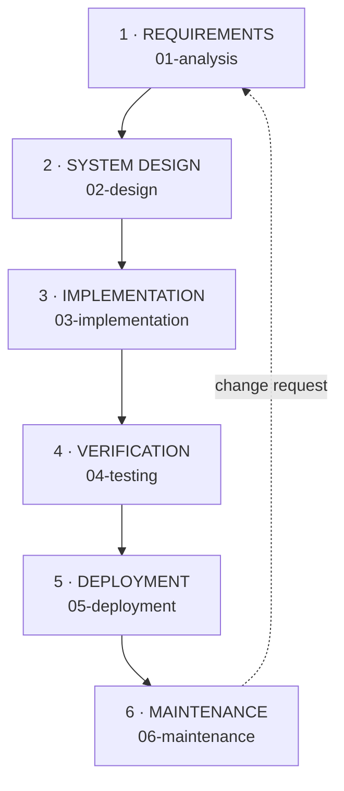

# SDLC — Waterfall Model

**Commencys is built with the Waterfall software development life cycle.**
Each phase finishes completely — with a signed-off deliverable — before the
next begins. This page is the backbone of the documentation: every phase below
is a child page with its entry criteria, deliverables, and exit gate.

## Why Waterfall fits this project

1. **Frozen requirements.** The RPL course spec fixes the acceptance criteria
   (sub-5-second SOS ack, acknowledged ≠ dispatched, AI never blocks SOS)
   up front — there is nothing to "discover" mid-sprint.
2. **Regulated domain.** Emergency response demands traceability: every line
   of code maps back to a requirement, and every requirement maps forward to
   a test. Waterfall's document-per-phase discipline gives that for free.
3. **Small fixed team.** Three developers, fixed roles (see
   [Planning](00-planning.md)) — sequential phases avoid coordination
   overhead.

## The six phases

| # | Phase | Objective | Key deliverable | Doc |
|---|-------|-----------|-----------------|-----|
| 1 | Requirements | Freeze *what* the system must do | Acceptance criteria C1–C4, FR-1–FR-8, NFR-1–NFR-7 | [01-analysis](01-analysis.md) |
| 2 | System Design | Freeze *how* it is built | Architecture, ticket lifecycle, taxonomy, component map | [02-design](02-design.md) |
| 3 | Implementation | Build exactly what was designed | FastAPI backend + Flutter client | [03-implementation](03-implementation.md) |
| 4 | Verification | Prove every requirement holds | Backend + model tests, CI gate, QA checklist | [04-testing](04-testing.md) |
| 5 | Deployment | Ship to real phones + server | Release APK, install runbook, release history | [05-deployment](05-deployment.md) |
| 6 | Maintenance | Operate, monitor, improve | Coordinator SOPs, model lifecycle, incident playbooks | [06-maintenance](06-maintenance.md) |

Phase 0, [Planning](00-planning.md) (problem statement, MVP scope,
milestones, risks), is the project charter that authorises the Waterfall run.

## Phase gates

No phase is entered until the previous gate is signed off:

| Gate | Exit criteria |
|------|---------------|
| G1 Requirements → Design | All 4 acceptance criteria written, testable, and mapped to FR/NFR |
| G2 Design → Implementation | Architecture + lifecycle + API contract reviewed; no open design TODO on the hot path |
| G3 Implementation → Verification | `pytest` + `flutter test` pass locally; SOS < 5 s proven on the hot path |
| G4 Verification → Deployment | CI green (backend + analyze + test + release APK); manual QA checklist complete |
| G5 Deployment → Maintenance | Versioned APK published with SHA-256; backend running as a supervised service |
| G6 Maintenance loop | Change requests re-enter at Phase 1 (requirements), never as silent hot-fixes |

## Traceability matrix

Every acceptance criterion is traceable end to end:

| Criterion | Design | Implementation | Verification |
|-----------|--------|----------------|--------------|
| C1 Minimal-interaction SOS + GPS | Lifecycle `acknowledged`, accuracy radius | `sos_screen.dart`, `location_service.dart`, `POST /api/sos` | `test_sos_ack_under_budget`, accuracy round-trip |
| C2 Sub-5-second ack | Hot path has no AI node | `main.py` persist-first, `X-Process-Time-Ms` | Wall-clock CI test, p95 alert at 4 s |
| C3 Acknowledged ≠ dispatched | `reported → acknowledged → broadcast → dispatched → resolved` | `StatusTimeline` stepper widget | `test_dispatch_transitions_status` |
| C4 AI never blocks SOS | AI as `BackgroundTasks` only | `ai_pipeline.py` async workers | SOS completes with no model loaded |

## Change control

Waterfall is rigid by design. Post-deployment changes (e.g. the Apple
liquid-glass UI reskin, commit `a811497`) are recorded as **maintenance-phase
change requests**: scoped in writing, implemented against the frozen API
contract, re-verified by the full CI gate, and released as a new versioned
APK — never patched around the process.
